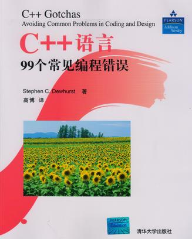

[《C++语言99个常见编程错误》](https://book.douban.com/subject/3767699/)读书笔记。

# 目录

[1. 基础问题.md](1. 基础问题.md)

[2. 语法问题](2. 语法问题.md)

[3. 预处理器问题](3. 预处理器问题.md)

[4. 类型转换问题](4. 类型转换问题.md)

[5. 初始化问题](5. 初始化问题.md)

[6. 内存和资源管理问题](6. 内存和资源管理问题.md)

[7. 多态问题](7. 多态问题.md)