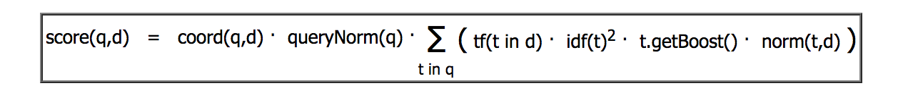

# 2.1 Apache Lucene 默认评分公式

文档得分是刻画文档与查询匹配程度的参数。

## 2.2.1 何时文档被匹配上

同一个文档在不同查询中的得分不具比较性。

为了计算文档得分，要考虑一下因素：

- 文档权重（document boost）：索引期赋予某个文档的权重值。
- 字段权重（field boost）：查询期赋予某个字段的权重值。
- 协调因子（coord）：基于文档中词项命中个数的协调因子，一个文档命中了查询中的词项越多，得分越高。
- 逆文档频率（inverse document frequency）：一个基于词项的因子，告诉评分公示该词项多么罕见。评分公示利用该因子为包含罕见词项的文档加权。
- 长度范数（length norm）：每个字段的基于词项个数的归一化因子。一个字段包含的词项数越多，该因子的权重越低。这意味着Lucene评分公示更喜欢包含较少词项的字段。
- 词频（term frequency）：表示一个词项在某个文档中出现了多少次。词频越高，文档得分越高。
- 查询范数（query norm）：基于查询的归一化因子，等于查询中词项的权重平方和。查询范数使得不同查询的得分能相互比较，尽管这种比较通常是困难且不可行的。

## 2.1.2 TF/IDF 评分公式

Lucene 实际使用的评分公式：

求和公式中的每个加数是以下因子的连乘：词频、逆文档频率、词项权重、长度范数。

## 2.1.3 Elasticsearch 如何看评分

Elasticsearch使用了Lucene的评分公式，但不限于Lucene的评分功能。用户可以使用不同的查询类型来控制文档评分的计算，还可以使用脚本来改变文档得分，还可以使用二次评分功能。

# 2.2 查询改写

