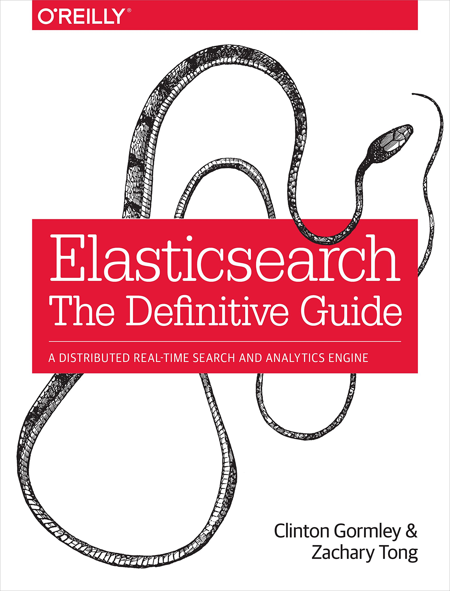

[《Elasticsearch权威指南》](https://book.douban.com/subject/25868239/)读书笔记

Elasticsearch 是一个分布式、可扩展、实时的搜索与数据分析引擎。 它能从项目一开始就赋予你的数据以搜索、分析和探索的能力。

# 目录

## Part.I 基础入门

[1、你知道的，为了搜索](1、你知道的，为了搜索.md)

[2、集群内的原理](2、集群内的原理.md)

[3、数据输入和输出](3、数据输入和输出.md)

[4、分布式文档存储](4、分布式文档存储.md)

[5、搜索--最基本的工具](5、搜索--最基本的工具.md)

[6、映射和分析](6、映射和分析.md)

[7、请求体查询](7、请求体查询.md)

[8、排序与相关性](8、排序与相关性.md)

[9、执行分布式检索](9、执行分布式检索.md)

[10、索引管理](10、索引管理.md)

[11、分片内部原理](11、分片内部原理.md)

## Part.II 深入搜索

[12、结构化搜索](12、结构化搜索.md)

[13、全文搜索](13、全文搜索.md)

[14、多字段搜索](14、多字段搜索.md)

[15、近似匹配](15、近似匹配.md)

[16、部分匹配](16、部分匹配.md)

[17、控制相关度](17、控制相关度.md)

## Part.III 处理人类语言

[18、开始处理各种语言](18、开始处理各种语言.md)

## Part.VI 数据建模

[41、嵌套对象](41、嵌套对象.md)

## Part.VII 管理、监控和部署

[44、监控](44、监控.md)

[45、部署](45、部署.md)

[46、部署后](46、部署后.md)
