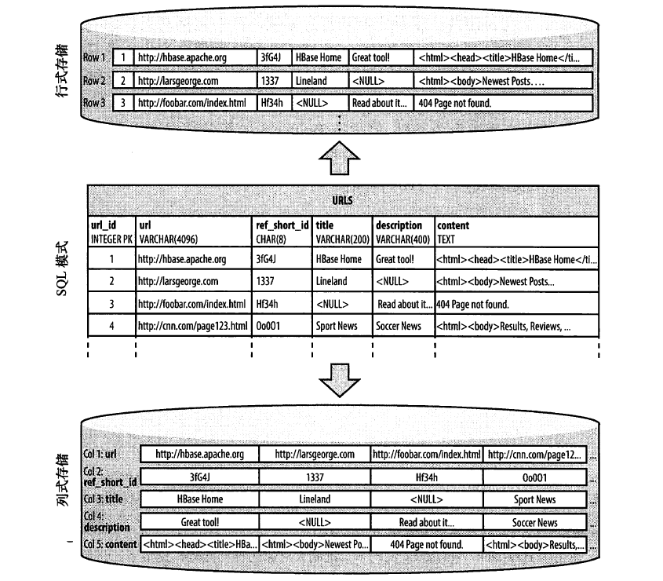

# 1.1 海量数据的黎明

数据的价值日益凸显。

Hadoop 擅长存储任意的、半结构化的数据，甚至是非结构化的数据。它几乎是现有数据库系统的一种补充，给用户提供了数据存储的无限空间。

大多数的RDBMS都遵守Codd's 12 rules。列式存储数据库以列为单位聚合数据，然后将列值顺序地存入磁盘，而行式数据库则是连续地存储整行。列式存储的出现是基于这一假设：对于特定的查询，不是所有的值都是必须的。另外，列式存储对压缩更友好。

HBase 以列式存储的格式在磁盘上存储数据。传统的列式数据库适合实时存储数据的场景，而HBase适合键值对的数据存取，或者有序的数据存取。

# 1.2 关系数据库系统的问题

