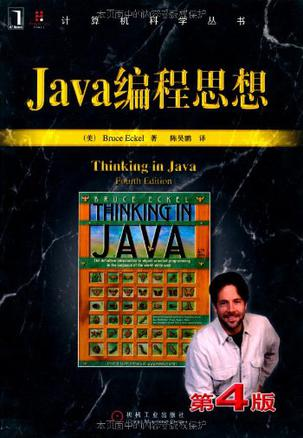

<!-- START doctoc generated TOC please keep comment here to allow auto update -->
<!-- DON'T EDIT THIS SECTION, INSTEAD RE-RUN doctoc TO UPDATE -->
**Table of Contents**  *generated with [DocToc](https://github.com/thlorenz/doctoc)*

- [目录](#%E7%9B%AE%E5%BD%95)

<!-- END doctoc generated TOC please keep comment here to allow auto update -->

[《Java编程思想》](https://book.douban.com/subject/2130190/)读书笔记。

# 目录

[1. 对象导论](对象导论.md)

[2. 一切都是对象](一切都是对象.md)

