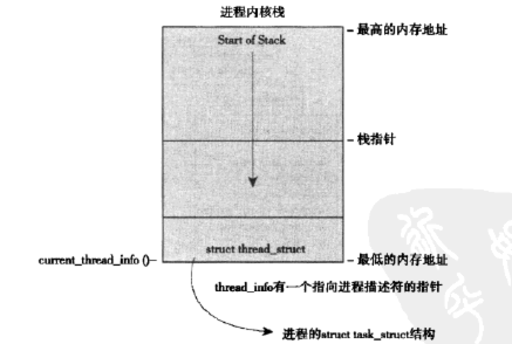

# 3.1 进程

进程就是处于执行期的程序，但进程不仅仅局限于一段可执行程序代码，还包括其他资源，像打开的文件、挂起的信号、内核内部数据、处理器状态、内存地址空间、执行线程。

执行线程，是进程中活动的对象。每个线程都拥有一个独立的程序计数器、进程栈、一组进程寄存器。内核调度的对象是线程，而不是进程。Linux系统的线程实现非常特别：**它对线程和进程并不特别区分**。

进程提供两种虚拟机制：虚拟处理器和虚拟内存。许多进程分享一个处理器，虚拟处理器给进程一种假象，让进程觉得自己在独占处理器。虚拟内存让进程在分配和管理内存时觉得自己拥有所有的内存资源。

进程在创建它的时刻开始存活，这是`fork()`的结果。该系统调用通过复制一个现有进程来创建一个新的进程。创建新的进程都是为了立即执行新的、不同的程序，接着调用`exec()`这组函数就可以创建新的地址空间，并把新的程序载入其中。现代Linux内核中，`fork()`实际上是由`clone()`系统调用实现的。

最终，程序通过`exit()`退出执行，这个系统调用会终结进程并释放占用的资源。父进程可以通过`wait4()`查询子进程是否终结。进程退出执行后被设置为僵死状态，知道它的父进程调用`wait()`或`waitpid()`为止。

# 3.2 进程描述符及任务结构

内核把进程的列表存放在任务队列中，队列是一个双向循环链表，每个元素都是类型为`task_struct`，成为进程描述符的结构。该结构定义在`<linux/sched.h>`文件中。进程描述符包含了一个具体进程的所有信息：

- 打开的文件
- 进程的地址空间
- 挂起的信号
- 进程的状态

## 分配进程描述符

Linux通过slab分配器分配`task_struct`结构，这样就达到了对象复用和缓存着色（cache coloring）的目的。slab分配器动态生成`task_struct`，只需在栈底或栈顶创建新歌新的结构`struct thread_info`。

```c
// <asm/thread_info.h>

struct thread_info {
  struct task_struct *task;
  struct exec_domain *exec_domain;
  __u32 flags;
  __u32 status;
  __u32 cpu;
  int preempt_count;
  mm_segment_t addr_limit;
  struct restart_block restart_block;
  void *sysenter_return;
  int uaccess_err;
};
```



每个任务的`thread_info`结构在它的内核栈的尾端分配，结构中的`task`存放的是指向该任务实际`task_struct`的指针。

## 进程描述符的存放

内核通过一个唯一的进程标识值（PID）来标识每个进程。PID是一个数，标识为`pid_t`隐含类型，实际就是一个`int`。内核把每个进程的PID存放在各自的进程描述符中。PID的最大值默认为32768（short int的最大值），这个限制在`<linux/threads.h>`定义。

内核中，访问任务通常需要获得指向其`task_struct`的指针。通过`current`宏查找当前正在运行进程的进程描述符。不同的硬件结构有不同的实现。

## 进程状态

进程描述符中的`state`描述了当前进程的状态:

- TASK_RUNNING
- TASK_INTERRUPTIBLE
- TASK_UNINTERRUPTIBLE
- __TASK_TRACED
- __TASK_STOPPED

# 导航

[目录](README.md)

上一章：[2. 从内核出发](2. 从内核出发.md)

下一章：
