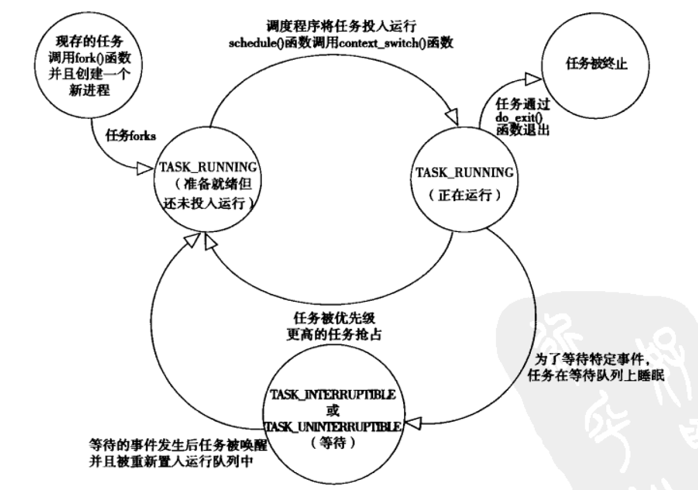

# 3.1 进程

进程就是处于执行期的程序，但进程不仅仅局限于一段可执行程序代码，还包括其他资源，像打开的文件、挂起的信号、内核内部数据、处理器状态、内存地址空间、执行线程。

执行线程，是进程中活动的对象。每个线程都拥有一个独立的程序计数器、进程栈、一组进程寄存器。内核调度的对象是线程，而不是进程。Linux系统的线程实现非常特别：**它对线程和进程并不特别区分**。

进程提供两种虚拟机制：虚拟处理器和虚拟内存。许多进程分享一个处理器，虚拟处理器给进程一种假象，让进程觉得自己在独占处理器。虚拟内存让进程在分配和管理内存时觉得自己拥有所有的内存资源。

进程在创建它的时刻开始存活，这是`fork()`的结果。该系统调用通过复制一个现有进程来创建一个新的进程。创建新的进程都是为了立即执行新的、不同的程序，接着调用`exec()`这组函数就可以创建新的地址空间，并把新的程序载入其中。现代Linux内核中，`fork()`实际上是由`clone()`系统调用实现的。

最终，程序通过`exit()`退出执行，这个系统调用会终结进程并释放占用的资源。父进程可以通过`wait4()`查询子进程是否终结。进程退出执行后被设置为僵死状态，知道它的父进程调用`wait()`或`waitpid()`为止。

# 3.2 进程描述符及任务结构

内核把进程的列表存放在任务队列中，队列是一个双向循环链表，每个元素都是类型为`task_struct`，成为进程描述符的结构。该结构定义在`<linux/sched.h>`文件中。进程描述符包含了一个具体进程的所有信息：

- 打开的文件
- 进程的地址空间
- 挂起的信号
- 进程的状态

## 分配进程描述符

Linux通过slab分配器分配`task_struct`结构，这样就达到了对象复用和缓存着色（cache coloring）的目的。slab分配器动态生成`task_struct`，只需在栈底或栈顶创建新歌新的结构`struct thread_info`。

```c
// <asm/thread_info.h>

struct thread_info {
  struct task_struct *task;
  struct exec_domain *exec_domain;
  __u32 flags;
  __u32 status;
  __u32 cpu;
  int preempt_count;
  mm_segment_t addr_limit;
  struct restart_block restart_block;
  void *sysenter_return;
  int uaccess_err;
};
```


每个任务的`thread_info`结构在它的内核栈的尾端分配，结构中的`task`存放的是指向该任务实际`task_struct`的指针。

## 进程描述符的存放

内核通过一个唯一的进程标识值（PID）来标识每个进程。PID是一个数，标识为`pid_t`隐含类型，实际就是一个`int`。内核把每个进程的PID存放在各自的进程描述符中。PID的最大值默认为32768（short int的最大值），这个限制在`<linux/threads.h>`定义。

内核中，访问任务通常需要获得指向其`task_struct`的指针。通过`current`宏查找当前正在运行进程的进程描述符。不同的硬件结构有不同的实现。

## 进程状态

进程描述符中的`state`描述了当前进程的状态:

- TASK_RUNNING。进程是可执行的，要么正在执行，要么在运行队列中等待执行。这是进程在用户空间中执行的唯一可能的状态。
- TASK_INTERRUPTIBLE。进程被阻塞，等待某个条件的达成。一旦条件达成或者被信号提前唤醒，内核就会把进程状态设置为运行。
- TASK_UNINTERRUPTIBLE。除了就算是接收到信号也不会被唤醒或准备投入运行外，这个状态与`TASK_INTERRUPTIBLE`相同。
- __TASK_TRACED。被其他进程追踪的进程，例如通过`ptrace`对调试程序进行跟踪。
- __TASK_STOPPED。进程停止执行，进程没有投入运行也不能投入运行。通常这种状态发生在接收到`SIGSTOP`、`SIGTSTP`、`SIGTTIN`、`SIGTOU`等信号的时候。此外，在调试期间接收到任何信号，都会使进程进入这种状态。



##  设置当前进程状态

内核调整某个进程的状态，使用`set_task_state(task, state)`函数。必要的时候，它会设置内存屏障来强制其他处理器做重新排序（一般只有SMP系统有此必要）。

## 进程上下文

一般程序在用户空间执行，当一个程序执行了系统调用或者触发了某个异常，它就陷入了内核空间。此时，内核『代表进程执行』并处于进程上下文中。在此上下文中，`current`宏是有效的。

## 进程家族树

Unix系统的进程之间存在明显的继承关系。所有的进程都是PID为1的init进程的后代。内核在系统启动的最后阶段启动init，该进程读取系统的初始化脚本（initscript）并执行其它的相关程序，最终完成系统启动的整个过程。

每个进程必有一个父进程，每个进程可以有0到多个子进程。进程间的关系存放在进程描述符中。`task_struct`有一个指向父进程`task_struct`的`parent`指针，还有一个`children`子进程链表。

init进程的进程描述符是作为`init_task`静态分配的。

在这种继承关系中，从任意一个进程都可以查找到指定的其它进程。

# 3.3 进程创建

Unix的进程创建可分解为两个单独的函数：

- `fork()`：拷贝当前进程创建一个子进程，父子进程的区别仅在于PID、PPID和某些资源的统计量。
- `exec()`：读取可执行文件，并将其载入地址空间开始运行。

## 写时拷贝

Linux的`fork()`使用写时拷贝（copy-on-write）页实现。创建新进程的时候，内核并不复制整个进程地址空间，而是让父子进程共享同一个拷贝。只有在需要写入时，数据才会被复制。

`fork()`的实际开销就是复制父进程的页表以及给子进程创建唯一的进程描述符。一般情况下，进程创建后会马上运行一个可执行文件，这种优化可以避免拷贝大量根本就不会用到的数据。

## `fork()`

Linux通过`clone()`系统调用来实现`fork()`，这个调用通过一些列的参数来指明父子进程需要共享的资源。`clone()`会调用`do_fork()`，后者完成了创建中的大部分工作。`do_fork()`定义在`kernel/fork.c`中，调用`copy_process()`函数，然后让进程开始运行。

`copy_process()`的工作：

1. 调用`dup_task_struct()`为新进程创建一个内核栈、`thread_info`结构和`task_struct`，这些值与当前进程相同。
2. 检查并确保新创建这个子进程后，当前用户所拥有的进程数目没有超过给它分配的资源限制。
3. 子进程着手将自己与父进程区别开来。初始化进程描述符中的许多成员，主要是统计信息。
4. 子进程的状态被设置为`TASK_UNINTERRUPTIBLE`，确保它不会投入运行。
5. 调用`copy_flags()`更新`task_struct`的`flags`成员，`PF_SUPERPRIV`标识被清零，设置`PF_FORKNOEXEC`被设置。
6. 调用`alloc_id()`为新进程分配一个有效的PID。
7. 根据传递给`clone()`的参数标识，`copy_process()`拷贝或共享打开的文件、文件系统信息、信号处理函数、进程地址空间和命名空间等。一般情况下，这些资源会被给定进程的所有线程共享；否则，这些资源对每个进程是不同的，因此被拷贝到这里。
8. 最后，`copy_process()`返回一个指向子进程的指针。

回到`do_fork()`，`copy_process()`返回成功，新创建的子进程被唤醒并让其投入运行。内核有意让子进程首先执行，因为一般子进程都会马上调用`exec()`函数，这样可以避免写时拷贝的额外开销。如果父进程首先执行的话，有可能会开始向地址空间写入。

## `vfork()`

除了不拷贝父进程的页表项之外，`vfork()`与`fork()`的功能相同。

`vfork()`的实现是通过向`clone()`传递一个特殊标志进行的：

1. 调用`copy_process()`时，`task_struct`的`vfor_done`成员被设置为`NULL`。
2. 执行`do_fork()`时，如果给定特别标识，则`vfor_done`会指向一个特定地址。
3. 子进程先开始执行后，父进程不是马上恢复执行，而是一直等待，直到子进程通过`vfor_done`指针向它发送信号。
4. 调用`mm_release()`时，该函数用于进程退出内存地址空间，并检查`vfor_done`是否为空。如果不为空，则向父进程发送信号。
5. 回到`do_fork()`，父进程醒来并返回。

如果一切顺利，子进程在新的地址空间运行，而父进程恢复之后也在原地址空间运行。这样，开销就降低了。

# 3.4 线程在Linux中的实现

Linux将线程当做进程来实现。。内核没有特别的线程调度算法或线程数据结构，线程被视作与其它进程共享某些资源的进程。每个线程都有一个属于自己的`task_struct`。

## 创建线程

线程的创建于普通进程类似，只不过在调用`clone()`的时候传入一些特殊参数来指明要共享的资源：

```c
clone(CLONE_VM | CLONE_FS | CLONE_FILES | CLONE_sighAND, 0)
```

这些参数在`<linux/sched.h>`中定义。

## 内核线程

内核在后台执行的操作，是通过内核线程完成的。与普通的进程区别在于，内核线程没有独立的地址空间，只在内核空间运行。内核线程也可以被调度，被抢占。

内核线程只能由其他内核线程创建，通过`<linux/kthread.h>`的接口：

```c
struct task_struct *kthread_create(int (*threadfn)(void *data),
                                  void *data,
                                  const char namefmt[],
                                  ...)
```

新的任务是由`kthread`内核进程通过`clone()`创建的。新的进程运行`threadfn`函数，给其传递的参数为`data`，进程被命名为`namefmt`。新的进程处于不可运行状态，除非通过`wake_up_process()`唤醒它。

创建一个进程并让其运行，通过`kthread_run()`实现：

```c
struct task_struct *kthread_run(int (*threadfn)(void *data),
                                  void *data,
                                  const char namefmt[],
                                  ...)
```

这个函数是以宏实现的，简单调用了`kthread_create()`和`wake_up_process()`。

内核线程启动后一直运行，直到`do_exit()`调用，或者内核的其他部分调用`kthread_stop()`退出：

```c
int kthread_stop(struct task_struct *k)
```

# 3.5 进程终结


# 导航

[目录](README.md)

上一章：[2. 从内核出发](2. 从内核出发.md)

下一章：
