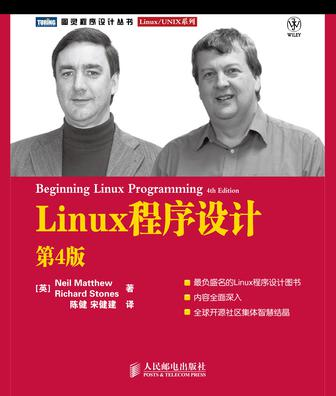

[《Linux程序设计》](https://book.douban.com/subject/4831448/) 读书笔记。

# 目录

[1. 入门](1. 入门.md)

[2. shell程序设计](2. shell程序设计.md)

[3. 文件操作](3. 文件操作.md)

[4. Linux环境](4. Linux环境.md)

[5. 终端](5. 终端.md)

[6. curses函数库](6. curses函数库.md)

[7. 数据管理](7. 数据管理.md)
