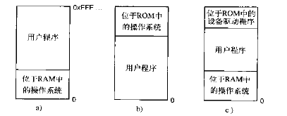

# 基本存储管理

## 无交换或分页的单道程序设计

一次只运行一个程序，与OS共享内存。

## 固定分区的多道程序设计

将内存划分为多个分区，当一个作业到达时，可以被放到能容纳这个作业的最小分区的输入队列里。

多道程序设计带来的两个重要问题是：重定位和保护。重定位的解决方案就是当程序调入时直接对指令进行修改。为了实现保护，IBM 360将内存分块，每块都有一个保护码。

一种解决重定位和保护问题的方法是设置两个硬件寄存器：基址寄存器和界限寄存器。
 

# 交换

存储管理有两种通用方法：交换和虚拟存储器。

交换会产生很多空闲区，这时要用到内存紧缩技术。

在动态分配内存时，操作系统有两种方式跟踪内存使用情况：位图和空闲表（链表）

当按照地址顺序在链表中存放进程和空闲区时，有几个算法来为新创建的进程分配空间：

1) 首次适配。

2) 下次适配。

3) 最佳适配。

4) 最差适配。

5) 快速适配：它为常用大小的空闲区维护单独的链表。

 

# 虚拟存储器

覆盖技术

 

# 分页

页表给出了虚拟地址和物理内存地址之间的映射关系。最简单的设计是由一组快速硬件寄存器组成的单个页表。也可以采用多级页表。

倒排页表：在实际内存中，每一个页帧有一个页表，而不是每一个虚拟地址空间页面有一个表项。

 

## 页面置换算法

1. 最优页面置换算法：标记最大的页面应该被淘汰

2. 最近未使用

3. 先进先出

4. 第二次机会

5. 时钟页面置换算法

6. 最近最少使用

7. 工作集：工作集就是最近K次内存访问所用过的页面的集合

8. 工作集时钟

# 分段

段是一个逻辑实体，一个段可能包括一个过程、数组、堆栈、数值变量，但一般不会包括多种不同类型的内容。

# 导航

上一章：[3. 死锁](3. 死锁.md)

下一章：
