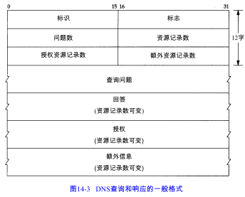
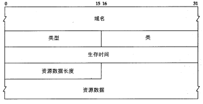

DNS是一种用于TCP/IP应用程序的分布式数据库，它提供主机名字和IP地址之间的转换及有关电子邮件的选路信息。

# DNS基础

没有哪个机构来管理域名树中的每个标识，相反，只有一个机构，即网络信息中心NIC负责分配顶级域和委派其他指定地区域的授权机构。

一个名字服务器负责一个或多个区域。一个区域的管理者必须为该区域提供一个主名字。服务器和至少一个辅助名字服务器。主、辅名字服务器必须是独立和冗余的，以便当某个名字服务器发生故障时不会影响该区域的名字服务。主、辅名字服务器的主要区别在于主名字服务器从磁盘文件中调入该区域的所有信息，而辅名字服务器则从主服务器调入所有信息。

# DNS的报文格式

 

DNS查询报文中的问题部分

DNS响应报文中的资源记录部分

# 指针查询

指针查询方式，即给定一个IP地址，返回与该地址对应的域名。

# 高速缓存

为了减少Internet上DNS的通信量，所有的名字服务器均使用高速缓存。在标准的Unix实现中，高速缓存是由名字服务器而不是由名字解析器维护的。

# 用UDP还是用 TCP

DNS名字服务器使用的熟知端口号无论对UDP还是TCP都是53。这意味着DNS均支持UDP和TCP访问。

# 小结

应用程序通过名字解析器将一个主机名转换为一个IP地址，也可将一个IP地址转换为与之对应的主机名。名字解析器将向一个本地名字服务器发出查询请求，这个名字服务器可能通过某个根名字服务器或其他名字服务器来完成这个查询。

所有的DNS查询和响应都有相同的报文格式。这个报文格式中包含查询请求和可能的回答资源记录、授权资源记录和附加资源记录。通过许多例子了解了名字解析器的配置文件以及 DNS的优化措施：指向域名的指针（减少报文的长度）、查询结果的高速缓存、 in-addr.arpa域（查找IP 地址对应的域名）以及返回的附加资源记录（避免主机重发同一查询请求）。

# 导航

[目录](README.md)

上一章：[13. ICMP：Internet组管理协议](13. ICMP：Internet组管理协议.md)

下一章：[15. TFTP：简单文件传送协议](15. TFTP：简单文件传送协议.md)
