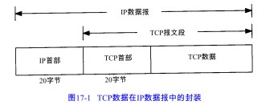
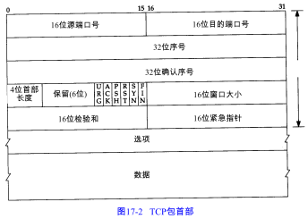

TCP提供一种面向连接的、可靠的字节流服务。

TCP通过下列方式来提供可靠性。

1. 应用数据被分割成TCP认为最适合发送的数据块。这和UDP完全不同，应用程序产生的数据报长度将保持不变。
2. 超时重传
3. 需要确认
4. 保持首部和数据的检验和
5. 数据后重新排序
6. 丢弃重复
7. 流量控制

TCP不在字节流中插入记录标识符。我们将这称为字节流服务。 TCP对字节流的内容不作任何解释。

# TCP首部

TCP首部的数据格式。如果不计任选字段，它通常是20个字节。

每个TCP段都包含源端和目的端的端口号，用于寻找发端和收端应用进程。这两个值加上IP首部中的源端IP地址和目的端IP地址唯一确定一个TCP连接。有时，一个IP地址和一个端口号也称为一个插口（socket）。

每个传输的字节都被计数，确认序号包含发送确认的一端所期望收到的下一个序号。

TCP为应用层提供全双工服务。这意味数据能在两个方向上独立地进行传输。

检验和覆盖了整个的TCP报文段：TCP首部和TCP数据。这是一个强制性的字段，一定是由发端计算和存储，并由收端进行验证。 TCP检验和的计算和UDP检验和的计算相似，使用一个伪首部。

许多流行的应用程序如Telnet、 Rlogin、FTP和SMTP都使用TCP。

# 导航

[目录](README.md)

上一章：[16、BOOTP：引导程序协议](16、BOOTP：引导程序协议.md)

下一章：[18、TCP连接的建立与终止](18、TCP连接的建立与终止.md)

