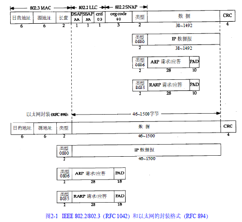
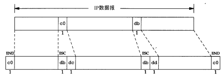
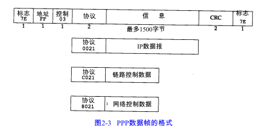

链路层主要有三个目的：

（1）为IP模块发送和接收IP数据报；

（2）为ARP模块发送ARP请求和接收ARP应答；

（3）为RARP发送RARP请求和接收RARP应答。

TCP/IP支持多种不同的链路层协议，这取决于网络硬件，如以太网、令牌环网、FDDI和RS-232串行线路等。

# 2.2 以太网和 IEEE 802封装

以太网是当今TCP/IP采用的主要的局域网技术。它采用一种称作CSMA/CD的媒体接入方法，其意思是带冲突检测的载波侦听多路接入（Carrier Sense, Multiple Access with Collision Detection）。它的速率为 10 Mb/s，地址为48 bit 。

| 802.3 | CSMA/CD网络 |
| ----- | --------- |
| 802.4 | 令牌总线网络    |
| 802.5 | 令牌环网络     |

两种帧格式都采用48bit（6字节）的目的地址和源地址。在802标准定义的帧格式中，长度字段是指它后续数据的字节长度，但不包括 CRC检验码。以太网的类型字段定义了后续数据的类型。

802定义的有效长度值与以太网的有效类型值无一相同，这样，就可以对两种帧格式进行区分。

# 2.4 SLIP：串行线路IP

SLIP的全称是Serial Line IP 。它是一种在串行线路上对IP数据报进行封装的简单形式。

下面的规则描述了SLIP协议定义的帧格式：

1)  IP数据报以一个称作END（0xc0）的特殊字符结束。为了防止数据报到来之前的线路噪声被当成数据报内容，大多数实现在数据报的开始处也传一个END字符。

2)  如果IP报文中某个字符为END，那么就要连续传输两个字节0xdb和0xdc来取代它。

3)  如果IP报文中某个字符为SLIP的ESC字符，那么就要连续传输两个字节0xdb和0xdd来取代它。

SLIP的缺陷：

1)  每一端必须知道对方的IP地址。没有办法把本端的IP地址通知给另一端。

2)  数据帧中没有类型字段（类似于以太网中的类型字段）。如果一条串行线路用于SLIP，那么它不能同时使用其他协议。

3)  SLIP没有在数据帧中加上检验和，只能通过上层协议来实现。

由于串行线路的速率较低，且通信常是交互式的，因此在SLIP线路上有许多小的TCP分组进行交换，这就带来了性能的缺陷。CSLIP是压缩的SLIP，它能把40个字节压缩到3-5个字节。

# 2.6 PPP：点对点协议

PPP，点对点协议修改了SLIP协议中的所有缺陷。 PPP包括以下三个部分：

1)  在串行链路上封装IP数据报的方法。PPP既支持数据为 8位和无奇偶检验的异步模式，还支持面向比特的同步链接。

2)  建立、配置及测试数据链路的链路控制协议（LCP：LinkControl Protocol ）。它允许通信双方进行协商，以确定不同的选项。

3)  针对不同网络层协议的网络控制协议（NCP）体系

每一帧都以标志字符0x7e开始和结束。紧接着是一个地址字节，值始终是0xff，然后是一个值为0x03的控制字节。

由于标志字符的值是0x7e，因此当该字符出现在信息字段中时， PPP需要对它进行转义。在同步链路中，该过程是通过一种称作比特填充 (bit stuffing)的硬件技术来完成的。

PPP比SLIP 具有下面这些优点： 

(1) PPP支持在单根串行线路上运行多种协议，不只是 IP协议；

(2) 每一帧都有循环冗余检验；

(3) 通信双方可以进行IP地址的动态协商 (使用IP网络控制协议 )；

(4) 与CSLIP类似，对 TCP和IP报文首部进行压缩； 

(5) 链路控制协议可以对多个数据链路选项进行设置。

# 2.7 环回接口

大多数的产品都支持环回接口（Loopback Interface），以允许运行在同一台主机上的客户程序和服务器程序通过TCP/IP进行通信。A 类网络号127就是为环回接口预留的。根据惯例，大多数系统把 IP地址127.0.0.1 分配给这个接口，并命名为localhost。一个传给环回接口的IP数据报不能在任何网络上出现。

一旦传输层检测到目的端地址是环回地址时，应该可以省略部分传输层和所有网络层的逻辑操作。但是大多数的产品还是照样完成传输层和网络层的所有过程，只是当IP数据报离开网络层时把它返回给自己。

需要指出的关键点：

1. 传给127.0.0.1的任何数据君合作为IP输入。
2. 传给广播地址或多播地址的数据报复制一份传给127.0.0.1，然后送到以太网上。
3. 任何传给该主机IP地址的数据均送到127.0.0.1。

# 2.8 最大传输单元 MTU

以太网和802.3对数据帧的长度都有一个限制，其最大值分别是1500和1492字节。链路层的这个特性称作MTU，最大传输单元。

# 2.9 路径 MTU

两台通信主机路径中的最小 MTU，路径MTU 在两个方向上不一定是一致的。

# 导航

[目录](README.md)

上一章：[1、概述](1、概述.md)

下一章：[3、IP：网际协议](3、IP：网际协议.md)
