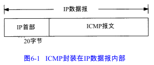
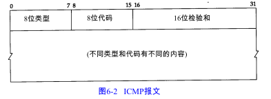
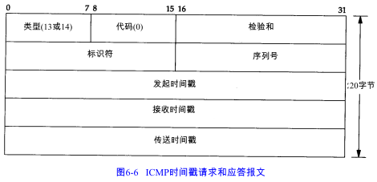
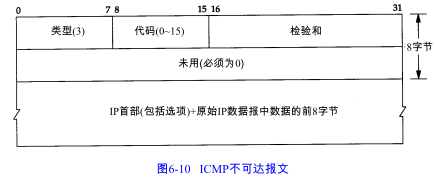

ICMP经常被认为是IP层的一个组成部分。它传递差错报文以及其他需要注意的信息。ICMP报文通常被IP层或更高层协议调用。

ICMP报文是在IP数据报内部被传输的。

检验和字段覆盖整个ICMP报文。

# 6.2 ICMP报文的类型

不同类型由报文中的类型字段和代码字段来共同决定：查询报文 or 差错报文

# 6.3 ICMP地址掩码请求与应答

ICMP地址掩码请求用于无盘系统在引导过程中获取自己的子网掩码。系统广播它的ICMP请求报文。无盘系统获取子网掩码的另一个方法是BOOTP协议

ICMP报文中的标识符和序列号字段由发送端任意选择设定，这些值在应答中将被返回。这样，发送端就可以把应答与请求进行匹配

# 6.4 ICMP时间戳请求与应答

ICMP时间戳请求允许系统向另一个系统查询当前的时间。返回的建议值是自午夜开始计算的毫秒数。这种ICMP报文的好书是提供了毫秒级的分辨率，但调用者必须通过其方法知道当前的日期。 

几乎所有的主机都把接收时间戳和发送时间戳设置成相同的值。我们仍然可以根据接收到应答时的时间值减去发送请求时的时间值算出往返时间（rtt）。

# 6.5 ICMP端口不可达差错

UDP的规则之一是，如果收到一份UDP数据报而目的端口与某个正在使用的进程不相符，那么UDP返回一个ICMP不可达报文。可以用TFTP来强制生成一个端口不可达报文。

ICMP报文是在主机之间交换的，而不用目的端口号，而每个20字节的UDP数据报。则是从一个特定端口。发送到另一个特定端口。

ICMP差错报文必须包括生成该差错报文的数据报IP首部（包含任何选项），还必须至少包括跟在该 IP首部后面的前8个字节。

一个重要的事实是包含在UDP首部中的内容是源端口号和目的端口号。就是由于目的端口号才导致产生了 ICMP端口不可达的差错报文。接收 ICMP的系统可以根据源端口号来把差错报文与某个特定的用户进程相关联。

导致差错的数据报中的IP首部要被送回的原因是因为IP首部中包含了协议字段，使得 ICMP可以知道如何解释后面的 8个字节。

# 导航

[目录](README.md)

上一章：[5、RARP：逆地址解析协议](5、RARP：逆地址解析协议.md)

下一章：[7、Ping程序](7、Ping程序.md)
