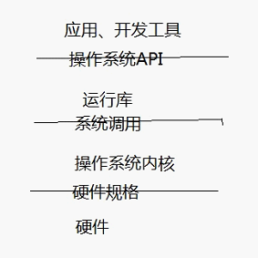

# 第1章 温故而知新

北桥运行的速度非常高，南桥专门处理低速设备，由南桥汇总后连接到北桥。

## 软件体系结构

*计算机科学领域的任何问题都可以通过增加一个间接的中间层来解决*。

计算机软件分为两块：平台性的、用于程序开发的。

计算机软件体系结构如下图：

## 操作系统

一个计算机资源主要分CPU，存储器，IO设备。

操作系统的一个功能是提供抽象的接口，另一个主要功能是管理硬件资源。

多道程序：某个程序暂时无法使用CPU时，另一等待CPU资源的程序启动，它最大问题是程序之间的调度策略太粗糙。

分时系统：程序协作模式。每个程序运行一段时间后，主动让出CPU。

多任务系统：引入进程、抢占式。

硬件逐渐被抽象为一系列的概念。驱动程序可以看作是操作系统的一部分，往往和操作系统内核一起运行在特权级，但又与操作系统内核之间有一定的独立性。

### 内存不够怎么办

内存分配策略要解决的三个问题：

1. 地址空间不隔离。

2. 内存使用效率低。

3. 程序运行的地址不确定。

虚拟地址：中间层，通过某些映射的办法，将虚拟地址转换为实际地址。每个进程都有自己独立的虚拟地址空间，而且每个进程只能访问自己的地址空间，这就做到了隔离。

分段：把一段程序所需要的内存空间大小的虚拟地址映射到某个地址空间。

分页：把地址空间人为地等分为固定大小的页，页的大小由硬件决定。

### 众人拾柴火焰高

线程是程序执行的最小单元，由线程ID、PC、寄存器集合和堆栈构成。通常每一个进程由一个到多个线程组成，各个线程之间共享程序的内存空间及进程级的资源。

多线程的优势：减少等待时间、程序逻辑要求并发、数据共享、发挥计算机的全部能力。

| 线程私有          | 线程之间共享（进程所有)           |
| ------------- | ---------------------- |
| 局部变量          | 全局变量                   |
| 函数的参数         | 堆上的数据                  |
| TLS（线程局部存储）数据 | 函数中的静态变量               |
| 寄存器（PC寄存器）    | 程序代码，任何程序都有权利读取并执行任何代码 |
| 栈             | 打开的文件，A线程打开的文件可以由B线程读写 |

单处理器对应多线程的情况下，并发是一种模拟出来的状态。线程的三种状态：运行、就绪、等待。主流的调度有优先级调度和轮转法。其中IO密集型（频繁等待）总是比CPU密集型线程容易得到优先级的提升。长时间得不到执行而被提升优先级。

优先级调度的环境下，线程的优先级改变有三种方式：

1. 用户指定优先级
2. 根据进入等待状态的频繁程度改变优先级
3. 长时间得不到执行而提升优先级

不可抢占线程主动放弃CPU有两种情况：

1. 当线程试图等待某事件
2. 线程主动放弃时间片

多线程程序处于一个多变的环境当中，可访问的全局变量和堆数据随时都可能被其他线程改变。

不同线程的寄存器是各自独立的。自增（++）操作在多线程环境下会出现错误是因为这个操作被编译为汇编代码之后不止一条指令，因此在执行的时候可能执行一半就被调度系统打断，去执行别的代码。我们把单指令的操作称为原子的（Atomic），因为无论如何，单指令的执行是不会被打断的。

### 同步与锁

如果要保证一个复杂的数据结构更改的原子性，原子操作指令就力不从心了，因此有了：锁。

1、二元信号量最简单的一种锁，即互斥锁；

2、多元信号量简称信号量——允许多个线程并发访问的资源（一个初始值为N的信号量允许N个线程并发访问）；

3、互斥量，和二元信号量类似。不同的是，互斥量要求哪个线程获取了互斥量，它就要负责释放

4、临界区其作用范围仅限于本进程，其他的进程无法获取该锁，除此之外，临界区具有和互斥量相同的性质；

5、读写锁用于读取频繁，而仅仅偶尔写入的情况，它有两种获取方式共享的或独占的。

6、条件变量一个条件变量可以被多个线程等待。其次，线程可以唤醒条件变量，此时某个或所有等待此条件变量的线程都会被唤醒并继续支持。

函数的**可重入**表示这个函数没有执行完成，由于外部因素或内部调用，又一次进入该函数执行。一个函数要被重入，只有两种情况：

1. 多个线程同时执行这个函数
2. 函数调用自身

一个函数要成为可重入的，必须有以下特点：

1. 不使用任何静态或全局的非const变量（或其指针）
2. 仅依赖于调用方提供的参数
3. 不依赖任何单个资源的锁
4. 不调用任何不可重入的函数

volatile关键字可以阻止过度优化，它基本可以做到两件事情：

1. 阻止编译器为了提高速度将一个变量缓存到寄存器内而不写回； 
2. 阻止编译器调整操作volatile变量的指令顺序。CPU的乱序执行能力让我们对多线程的安全保障的努力变得异常困难。因此要保证线程安全，阻止CPU换序是必需的。

 

线程模型分为三种：

1. 一对一模型（一个用户使用的线程唯一对应一个内核使用的线程）。优点：真正的并发，系统表现更好。缺点有两个：A、操作系统限制了内核线程的数量，因此一对一线程会让用户的线程数量受到限制。B、许多操作系统内核线程调度时，上下文切换的开销较大，导致用户线程的执行效率下降。
2. 多对一模型（将多个用户线程映射到一个内核线程上，线程之间的切换由用户态的代码来进行），一大问题是，如果其中一个用户线程阻塞，那么所有的线程都将无法执行，因为此时内核里的线程也随之阻塞了。
3. 多对多模型（结合了多对一模型和一对一模型的特点，将多个用户线程映射到少数但不止一个内核线程上）。

# 导航

[目录](README.md)

下一章：