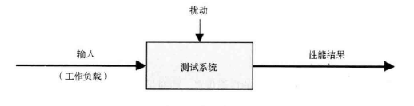
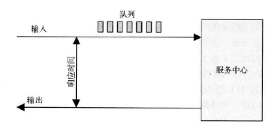

面对一个性能不佳且复杂的系统环境，第一个挑战就是知道从什么地方开始分析，收集什么样的数据，以及如何分析这些数据。

# 2.1 术语

关于性能的一些关键术语：

- IOPS：每秒的 IO 操作次数
- 吞吐量：数据传输的速度。某些情况下，吞吐量是指操作的速度（每秒的操作数）
- 响应时间：一次操作完成的时间
- 延时：描述操作里用来等待的时间
- 使用率：对于服务请求的资源，使用率描述在给定时间区间内，资源的繁忙程度
- 饱和度：某一资源无法满足服务的排队工作量
- 瓶颈
- 工作负载：系统的输入或者是对系统所施加的复杂
- 缓存

# 2.2 模型

## 2.2.1 受测系统

受测系统（SUT，system under test）的性能如图所示。

扰动（perturbation）是会影响结果的，扰动包括系统其他用户、其他的复杂等。

# 2.2.2 排队系统

# 2.3 概念

## 2.3.1 延时

延时是操作执行之前的等待时间，响应时间包括了延时和操作时间。

延时可以在不同点观测，所以要指明观测的对象。例如，网站的载入时间由三个不同的点观测的时间组成：DNS 延时，TCP 连接延时和 TCP 传输时间。

## 2.3.2 时间量级

系统各组件的延时

| 事件                      | 延时        | 相对时间比例 |
| ------------------------- | ----------- | ------------ |
| 1个CPU周期                | 0.3 ns      | 1 s          |
| L1 缓存访问               | 0.9 ns      | 3 s          |
| L2 缓存访问               | 2.8 ns      | 9 s          |
| L3 缓存访问               | 12.9 ns     | 43 s         |
| 主存访问                  | 120 ns      | 6 分         |
| 固态硬盘 I/O              | 50 - 150 us | 2-6 天       |
| 旋转磁盘 I/O              | 1 - 10 ms   | 1-12 月      |
| 互联网：旧金山 - 纽约     | 40 ms       | 4 年         |
| 互联网：旧金山 - 澳大利亚 | 183 ms      | 19 年        |
| TCP 包重传                | 1 - 3 s     | 105 - 317 年 |
| 物理系统重启              | 5 m         | 32 千年      |

# 2.3.3 权衡三角

性能/及时/成本低，这三样，最多只能获得两个。

一个常见的权衡是 CPU 和内存，内存可以缓存结果，降低 CPU 的使用。CPU 可以压缩数据来降低内存的使用。

# 2.3.4 调整的影响

性能调整发生在越靠近工作执行的地方，就越有效。

| 层级     | 调优对象                               |
| -------- | -------------------------------------- |
| 应用程序 | 执行的数据库请求                       |
| 数据库   | 数据库表的Schema、索引、缓冲           |
| 系统调用 | 内存映射、读写、同步或异步 I/O 标识    |
| 文件系统 | 记录大小、缓存大小、文件系统的可调参数 |
| 存储     | RAID级别，磁盘类型和数目               |

## 2.3.5 合适的层级

调优的层级，取决于性能技术投入的投资回报率，大公司可能有个团队来分析性能，包括内核、CPU 性能计数器。

