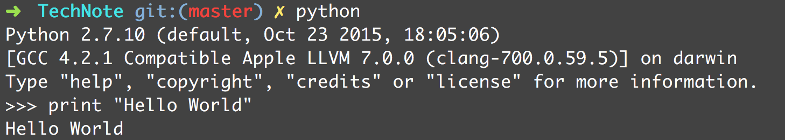

# 1.1 运行Python

Python程序是由解释器来执行的。通常在shell中输入`python`即可启动解释器：



Python的交互模式是它最有用的功能。你可以输入人以合法的语句或语句序列，然后立即看到结果。

> 交互模式中，特殊变量`_`保存最后一次运算的结果。

执行Python程序：

```shell
python hello.py
```

在UNIX中，可以在程序首行使用`#!`，如：

```python
#!/usr/bin/env python
print "Hello World"
```

# 1.2 变量和算术表达式

Python是动态类型的语言，在程序执行的过程中，变量名会被绑定到不同的值，而且这些值可以属于不同的类型。

变量名是无类型的，在执行过程中可以引用任意类型的数据。

在同一行上，使用分号来隔开多条语句。

