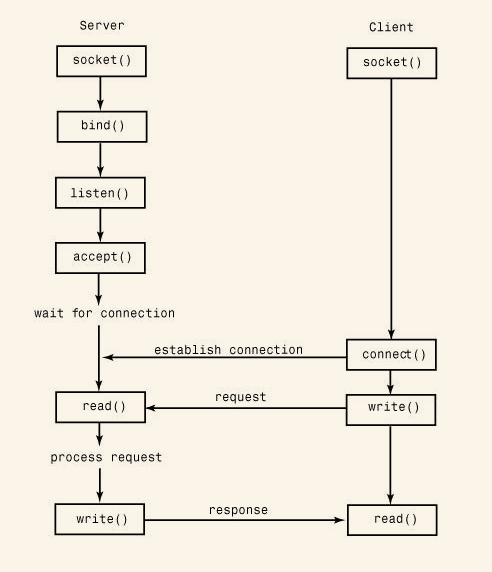

<!-- START doctoc generated TOC please keep comment here to allow auto update -->
<!-- DON'T EDIT THIS SECTION, INSTEAD RE-RUN doctoc TO UPDATE -->
**Table of Contents**  *generated with [DocToc](https://github.com/thlorenz/doctoc)*

- [21.1 Network Programming Basics](#211-network-programming-basics)
- [20.2 `asynchat`](#202-asynchat)
- [20.3 `asyncore`](#203-asyncore)

<!-- END doctoc generated TOC please keep comment here to allow auto update -->

# 21.1 Network Programming Basics

The TCP protocol is a reliable connection-oriented protocol used to establish a two-way communications stream between machines. UDP is a lower-level packet-based protocol (connectionless) in which machines send and receive discrete packets of information without formally establishing a connection. Unlike TCP, UDP communication is unreliable and thus inherently more complicated to manage in applications that require reliable communications

Both network protocols are handled through a programming abstraction known as a socket. A socket is an object similar to a file that allows a program to accept incoming connections, make outgoing connections, and send and receive data. Before two machines can communicate, both must create a socket object.

The machine receiving the connection (the server) must bind its socket object to a known port number.

TCP connection protocol:

UDP connection protocol:

# 20.2 `asynchat` 

The `asynchat` module simplifies the implementation of applications that implement asynchronous networking using the `asyncore` module. It does this by wrapping the low-level I/O functionality of `asyncore` with a higher-level programming interface that is designed for network protocols based on simple request/response mechanisms (for example, HTTP).   

To use this module, you must define a class that inherits from `async_chat`. Within this class, you must define two methods: `collect_incoming_data()` and `found_terminator()`. The first method is invoked whenever data is received on the network connection. Typically, it would simply take the data and store it someplace. The `found_terminator()` method is called when the end of a request has been detected. For example, in HTTP, requests are terminated by a blank line.

For data output, `async_chat` maintains a producer FIFO queue.

`async_chat([sock])`   Base class used to define new handlers.

An instance, `a`, of `async_chat` has the following methods in addition to those already provided by the asyncore.dispatcher base class:  

- `a.close_when_done()`   Signals an end-of-file on the outgoing data stream by pushing None onto the producer FIFO queue.
- `a.collect_incoming_data(data)`   Called whenever data is received on the channel.
- `a.found_terminator()`   Called when the termination condition set by `set_terminator()` holds.
- `a.push(data)`   Pushes data onto the channel’s outgoing producer FIFO queue.

`simple_producer(data [, buffer_size])`   Creates a simple producer object that produces chunks from a byte string data.

# 20.3 `asyncore`
The `asyncore` module is used to build network applications in which network activity is handled asynchronously as a series of events dispatched by an event loop, built using the `select()` system call.
