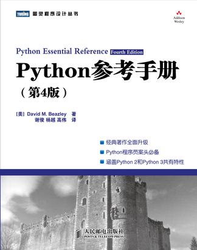

[《Python参考手册》](https://book.douban.com/subject/5401851/)

# 目录

## I: The Python Language

[1、Python简介](1、Python简介.md)

[2、词法约定和语法](2、词法约定和语法.md)

[3、类型与对象](3、类型与对象.md)

[4、运算符与表达式](4、运算符与表达式.md)

[5、程序结构与控制流](5、程序结构与控制流.md)

[6、函数与函数式编程](6、函数与函数式编程.md)

[7、类与面向对象编程](7、类与面向对象编程.md)

[8、模块、包与分发](8、模块、包与分发.md)

[9、输入与输出](9、输入与输出.md)

[10、执行环境](10、执行环境.md)

[11、测试、调试、探查与调优](11、测试、调试、探查与调优.md)

## II: The Python Library

[12. Build-In Functions and Exceptions](12-built-in-functions-and-exceptions.md)
