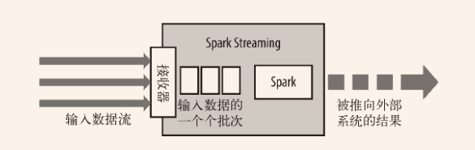
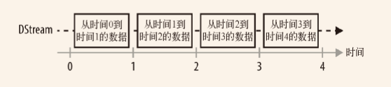
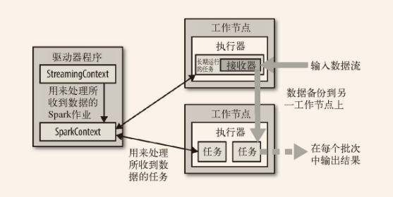

Spark Streaming 是 Spark 为这些应用而设计的模型。它允许用户使用一套和批处理非常接近的 API 来编写流式计算应用，这样就可以大量重用批处理应用的技术甚至代码。

Spark Streaming 使用离散化流 （discretized stream）作为抽象表示，叫作 DStream。DStream 是随时间推移而收到的数据的序列。在内部，每个时间区间收到的数据都作为 RDD 存在，而 DStream 是由这些 RDD 所组成的序列（因此得名“离散化”）。DStream 可以从各种输入源创建，比如 Flume、Kafka 或者 HDFS。

创建出来的 DStream 支持两种操作:
- 一种是转化操作 （transformation），会生成一个新的 DStream。
- 另一种是输出操作 （output operation），可以把数据写入外部系统中。

DStream 提供了许多与 RDD 所支持的操作相类似的操作支持，还增加了与时间相关的新操作，比如滑动窗口。

Spark Streaming 应用需要进行额外配置来保证 24/7 不间断工作。检查点 （checkpointing）机制，也就是把数据存储到可靠文件系统（比如 HDFS）上的机制，这也是 Spark Streaming 用来实现不间断工作的主要方式。

# 10.1 一个简单的例子

Spark Streaming的 sbt：

```properties
libraryDependencies ++= Seq("org.apache.spark" %% "spark-streaming_2.1.0" % "1.2.0")
``

```scala 
import org.apache.spark.streaming.StreamingContext
import org.apache.spark.streaming.StreamingContext._
import org.apache.spark.streaming.dstream.DStream
import org.apache.spark.streaming.Duration
import org.apache.spark.streaming.Seconds

// 从SparkConf创建StreamingContext并指定1秒钟的批处理大小
val ssc = new StreamingContext(conf, Seconds(1))
// 连接到本地机器7777端口上后，使用收到的数据创建DStream
val lines = ssc.socketTextStream("localhost", 7777)
// 从DStream中筛选出包含字符串"error"的行
val errorLines = lines.filter(_.contains("error"))
// 打印出有"error"的行
errorLines.print()

// 启动流计算环境StreamingContext并等待它"完成"
ssc.start()
// 等待作业完成
ssc.awaitTermination()”
```

一个 Streaming context 只能启动一次，所以只有在配置好所有 DStream 以及所需要的输出操作之后才能启动。


# 10.2 架构与抽象

Spark Streaming 从各种输入源中读取数据，并把数据分组为小的批次。新的批次按均匀的时间间隔创建出来。在每个时间区间开始的时候，一个新的批次就创建出来，在该区间内收到的数据都会被添加到这个批次中。在时间区间结束时，批次停止增长。时间区间的大小是由*批次间隔*这个参数决定的。每个输入批次都形成一个 RDD，以 Spark 作业的方式处理并生成其他的 RDD。处理的结果可以以批处理的方式传给外部系统。

高层次的架构如下图：



DStream是一个持续的RDD序列，你可以从外部输入源创建 DStream，也可以对其他 DStream 应用进行转化操作 得到新的 DStream。



除了转化操作以外，DStream 还支持输出操作，如 `print()` 。Spark Streaming 的输出操作在每个时间区间中周期性执行，每个批次都生成输出。

Spark Streaming 在 Spark 各组件中的执行过程：



Spark Streaming 为每个输入源启动对应的接收器 。接收器以任务的形式运行在应用的执行器进程中，从输入源收集数据并保存为 RDD。它们收集到输入数据后会把数据复制到另一个执行器进程来保障容错性（默认行为）。数据保存在执行器进程的内存中，和缓存 RDD 的方式一样。驱动器程序中的 StreamingContext 会周期性地运行 Spark 作业来处理这些数据，把数据与之前时间区间中的 RDD 进行整合。

Spark Streaming 对 DStream 提供的容错性与 Spark 为 RDD 所提供的容错性一致：只要输入数据还在，它就可以使用 RDD 谱系重算出任意状态。不过，如果只用谱系图来恢复的话，重算有可能会花很长时间，因为需要处理从程序启动以来的所有数据。因此，Spark Streaming 也提供了**检查点**机制，可以把状态阶段性地存储到可靠文件系统中（例如 HDFS 或者 S3）。


# 10.3 转换操作


