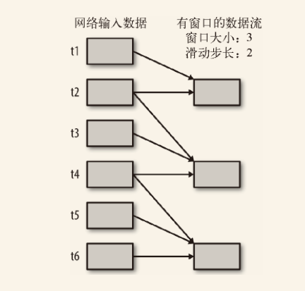
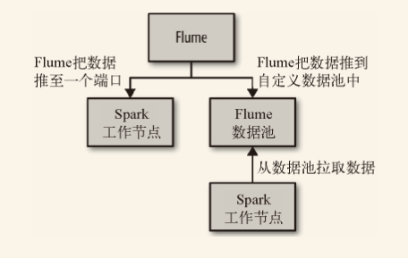

Spark Streaming 是 Spark 为这些应用而设计的模型。它允许用户使用一套和批处理非常接近的 API 来编写流式计算应用，这样就可以大量重用批处理应用的技术甚至代码。

Spark Streaming 使用离散化流 （discretized stream）作为抽象表示，叫作 DStream。DStream 是随时间推移而收到的数据的序列。在内部，每个时间区间收到的数据都作为 RDD 存在，而 DStream 是由这些 RDD 所组成的序列（因此得名“离散化”）。DStream 可以从各种输入源创建，比如 Flume、Kafka 或者 HDFS。

创建出来的 DStream 支持两种操作:
- 一种是转化操作 （transformation），会生成一个新的 DStream。
- 另一种是输出操作 （output operation），可以把数据写入外部系统中。

DStream 提供了许多与 RDD 所支持的操作相类似的操作支持，还增加了与时间相关的新操作，比如滑动窗口。

Spark Streaming 应用需要进行额外配置来保证 24/7 不间断工作。检查点 （checkpointing）机制，也就是把数据存储到可靠文件系统（比如 HDFS）上的机制，这也是 Spark Streaming 用来实现不间断工作的主要方式。

# 10.1 一个简单的例子

Spark Streaming的 sbt：

```properties
libraryDependencies ++= Seq("org.apache.spark" %% "spark-streaming_2.1.0" % "1.2.0")
``

```scala 
import org.apache.spark.streaming.StreamingContext
import org.apache.spark.streaming.StreamingContext._
import org.apache.spark.streaming.dstream.DStream
import org.apache.spark.streaming.Duration
import org.apache.spark.streaming.Seconds

// 从SparkConf创建StreamingContext并指定1秒钟的批处理大小
val ssc = new StreamingContext(conf, Seconds(1))
// 连接到本地机器7777端口上后，使用收到的数据创建DStream
val lines = ssc.socketTextStream("localhost", 7777)
// 从DStream中筛选出包含字符串"error"的行
val errorLines = lines.filter(_.contains("error"))
// 打印出有"error"的行
errorLines.print()

// 启动流计算环境StreamingContext并等待它"完成"
ssc.start()
// 等待作业完成
ssc.awaitTermination()”
```

一个 Streaming context 只能启动一次，所以只有在配置好所有 DStream 以及所需要的输出操作之后才能启动。


# 10.2 架构与抽象

Spark Streaming 从各种输入源中读取数据，并把数据分组为小的批次。新的批次按均匀的时间间隔创建出来。在每个时间区间开始的时候，一个新的批次就创建出来，在该区间内收到的数据都会被添加到这个批次中。在时间区间结束时，批次停止增长。时间区间的大小是由*批次间隔*这个参数决定的。每个输入批次都形成一个 RDD，以 Spark 作业的方式处理并生成其他的 RDD。处理的结果可以以批处理的方式传给外部系统。

高层次的架构如下图：


DStream是一个持续的RDD序列，你可以从外部输入源创建 DStream，也可以对其他 DStream 应用进行转化操作 得到新的 DStream。


除了转化操作以外，DStream 还支持输出操作，如 `print()` 。Spark Streaming 的输出操作在每个时间区间中周期性执行，每个批次都生成输出。

Spark Streaming 在 Spark 各组件中的执行过程：


Spark Streaming 为每个输入源启动对应的接收器 。接收器以任务的形式运行在应用的执行器进程中，从输入源收集数据并保存为 RDD。它们收集到输入数据后会把数据复制到另一个执行器进程来保障容错性（默认行为）。数据保存在执行器进程的内存中，和缓存 RDD 的方式一样。驱动器程序中的 StreamingContext 会周期性地运行 Spark 作业来处理这些数据，把数据与之前时间区间中的 RDD 进行整合。

Spark Streaming 对 DStream 提供的容错性与 Spark 为 RDD 所提供的容错性一致：只要输入数据还在，它就可以使用 RDD 谱系重算出任意状态。不过，如果只用谱系图来恢复的话，重算有可能会花很长时间，因为需要处理从程序启动以来的所有数据。因此，Spark Streaming 也提供了**检查点**机制，可以把状态阶段性地存储到可靠文件系统中（例如 HDFS 或者 S3）。


# 10.3 转换操作

DStream 的转化操作可以分为无状态 （stateless）和有状态 （stateful）两种。

- 在无状态转化操作 中，每个批次的处理不依赖于之前批次的数据。常见的 RDD 转化操作，如 `map()` 、`filter()` 、`reduceByKey()` 等，都是无状态转化操作。

- 有状态转化操作 需要使用之前批次的数据或者是中间结果来计算当前批次的数据。有状态转化操作包括基于滑动窗口的转化操作和追踪状态变化的转化操作。

## 10.3.1 无状态转化操作

无状态转化操作就是把简单的 RDD 转化操作应用到每个批次上，也就是转化 DStream 中的每一个 RDD。

DStream无状态转化操作的例子：`map()`、`flatMap()`、`filter()`、`repartition()`、`reduceByKey()`、`groupByKey()`。Spark

```scala 
// 假设ApacheAccessingLog是用来从Apache日志中解析条目的工具类
val accessLogDStream = logData.map(line => ApacheAccessLog.parseFromLogLine(line))
val ipDStream = accessLogsDStream.map(entry => (entry.getIpAddress(), 1))
val ipCountsDStream = ipDStream.reduceByKey((x, y) => x + y)
```

无状态转化操作也能在多个 DStream 间整合数据，不过也是在各个时间区间内。例如，键值对 DStream 拥有和 RDD 一样的与连接相关的转化操作，也就是 `cogroup()` 、`join()` 、`leftOuterJoin(` 等。

```scala 
// 连接两个DStreaming
val ipBytesDStream =
  accessLogsDStream.map(entry => (entry.getIpAddress(), entry.getContentSize()))
val ipBytesSumDStream =
  ipBytesDStream.reduceByKey((x, y) => x + y)
val ipBytesRequestCountDStream =
  ipCountsDStream.join(ipBytesSumDStream)
```

使用 DStream 的 `union()` 操作将它和另一个 DStream 的内容合并。也可以使用 `StreamingContext.union()`来合并多个流。

DStream 还提供了一个叫作 `transform()` 的高级操作符，可以让你直接操作其内部的 RDD。这个 `transform()` 操作允许你对 DStream 提供任意一个 RDD 到 RDD 的函数。这个函数会在数据流中的每个批次中被调用，生成一个新的流。`transform()` 的一个常见应用就是重用你为 RDD 写的批处理代码。

## 10.3.2 有状态转化操作

DStream 的有状态转化操作是跨时间区间跟踪数据的操作；也就是说，一些先前批次的数据也被用来在新的批次中计算结果。主要的两种类型是滑动窗口和 `updateStateByKey()` ，前者以一个时间阶段为滑动窗口进行操作，后者则用来跟踪每个键的状态变化（例如构建一个代表用户会话的对象）。

有状态转换操作需要在`StreamingContext`中打开检查点机制来确保容错性：

 ```scala
 ssc.checkpoint("hdfs://...")
 ```

### 基于窗口的转化操作

基于窗口的操作会在一个比 StreamingContext 的批次间隔更长的时间范围内，通过整合多个批次的结果，计算出整个窗口的结果。

所有基于窗口的操作都需要两个参数，分别为窗口时长以及滑动步长，两者都必须是 StreamContext 的批次间隔的整数倍。窗口时长控制每次计算最近的多少个批次的数据，其实就是最近的 `windowDuration/batchInterval` 个批次。



对 DStream 可以用的最简单窗口操作是 `window()` ，它返回一个新的 DStream 来表示所请求的窗口操作的结果数据。换句话说，`window()` 生成的 DStream 中的每个 RDD 会包含多个批次中的数据，可以对这些数据进行 `count()` 、`transform()` 等操作。

```scala
val accessLogsWindow = accessLogsDStream.window(Seconds(30), Seconds(10))
val windowCounts = accessLogsWindow.count()
```

Spark Streaming 还是提供了一些其他的窗口操作，让用户可以高效而方便地使用。首先，`reduceByWindow()` 和 `reduceByKeyAndWindow()` 让我们可以对每个窗口更高效地进行归约操作。它们接收一个归约函数，在整个窗口上执行，比如 `+` 。除此以外，它们还有一种特殊形式，通过只考虑新进入窗口的数据和离开窗口的数据，让 Spark 增量计算归约结果。这种特殊形式需要提供归约函数的一个逆函数，比如 `+` 对应的逆函数为 `-` 。对于较大的窗口，提供逆函数可以大大提高执行效率。

```scala
val ipDStream = accessLogsDStream.map(logEntry => (logEntry.getIpAddress(), 1))
val ipCountDStream = ipDStream.reduceByKeyAndWindow(
  {(x, y) => x + y}, // 加上新进入窗口的批次中的元素
  {(x, y) => x - y}, // 移除离开窗口的老批次中的元素
  Seconds(30),       // 窗口时长
  Seconds(10))       // 滑动步长
```

DStream 还提供了 `countByWindow()` 和 `countByValueAndWindow()` 作为对数据进行计数操作的简写。`countByWindow()` 返回一个表示每个窗口中元素个数的 DStream ，而 `countByValueAndWindow()` 返回的 DStream 则包含窗口中每个值的个数。

```scala
val ipDStream = accessLogsDStream.map{entry => entry.getIpAddress()}
val ipAddressRequestCount = ipDStream.countByValueAndWindow(Seconds(30), Seconds(10))
val requestCount = accessLogsDStream.countByWindow(Seconds(30), Seconds(10))
```

`updateStateByKey()` 为我们提供了对一个状态变量的访问，用于键值对形式的 DStream。给定一个由（键，事件）对构成的 DStream，并传递一个指定如何根据新的事件更新每个键对应状态的函数，它可以构建出一个新的 DStream，其内部数据为（键，状态）对。

要使用 `updateStateByKey()` ，提供了一个 `update(events, oldState)` 函数，接收与某键相关的事件以及该键之前对应的状态，返回这个键对应的新状态。

```scala
def updateRunningSum(values: Seq[Long], state: Option[Long]) = {
  Some(state.getOrElse(0L) + values.size)
}

val responseCodeDStream = accessLogsDStream.map(log => (log.getResponseCode(), 1L))
val responseCodeCountDStream = responseCodeDStream.updateStateByKey(updateRunningSum _)
```

# 10.4 输出操作

输出操作指定了对流数据经转化操作得到的数据所要执行的操作（例如把结果推入外部数据库或输出到屏幕上）。

与 RDD 中的惰性求值类似，如果一个 DStream 及其派生出的 DStream 都没有被执行输出操作，那么这些 DStream 就都不会被求值。如果 `StreamingContext` 中没有设定输出操作，整个 `context` 就都不会启动。

常用的一种调试性输出操作是 `print()` ，它会在每个批次中抓取 DStream 的前十个元素打印出来。

在 Scala 中将 DStream 保存为文本文件:

```scala
ipAddressRequestCount.saveAsTextFiles("outputDir", "txt")
```

一个更为通用的 `saveAsHadoopFiles()` 函数，接收一个 Hadoop 输出格式作为参数。

```scala
val writableIpAddressRequestCount = ipAddressRequestCount.map {
  (ip, count) => (new Text(ip), new LongWritable(count)) }
writableIpAddressRequestCount.saveAsHadoopFiles[
  SequenceFileOutputFormat[Text, LongWritable]]("outputDir", "txt")
```

还有一个通用的输出操作 `foreachRDD()` ，它用来对 DStream 中的 RDD 运行任意计算。这和 `transform()` 有些类似，都可以让我们访问任意 RDD。在 `foreachRDD()` 中，可以重用我们在 Spark 中实现的所有行动操作。

```scala
“ipAddressRequestCount.foreachRDD { rdd =>
  rdd.foreachPartition { partition =>
    // 打开到存储系统的连接（比如一个数据库的连接）
    partition.foreach { item => 
        // 使用连接把item存到系统中
    }
    // 关闭连接
  }
}
```


# 10.5 输入源

## 10.5.1 核心数据源

所有用来从核心数据源创建 DStream 的方法都位于 StreamingContext 中。

### 1. 文件流

Spark Streaming 也就支持从任意 Hadoop 兼容的文件系统目录中的文件创建数据流。

```scala
val logData = ssc.textFileStream(logDirectory)
```

除了文本数据，也可以读入任意 Hadoop 输入格式。只需要将 Key 、Value 以及 InputFormat 类提供给 Spark Streaming 即可。

```scala
ssc.fileStream[LongWritable, IntWritable,
    SequenceFileInputFormat[LongWritable, IntWritable]](inputDirectory).map {
    case (x, y) => (x.get(), y.get())
}
```

### 2. Akka actor 流

另一个核心数据源接收器是 actorStream ，它可以把 Akka actor 作为数据流的源。要创建出一个 actor 流，需要创建一个 Akka actor，然后实现 `org.apache.spark.streaming.receiver.ActorHelper` 接口。要把输入数据从 actor 复制到 Spark Streaming 中，需要在收到新数据时调用 actor 的 `store()` 函数。

## 10.5.2　附加数据源

### 1. Apache Kafka

在 Scala 中用 Apache Kafka 订阅 Panda 主题：

```scala
import org.apache.spark.streaming.kafka._
...
// 创建一个从主题到接收器线程数的映射表
val topics = List(("pandas", 1), ("logs", 1)).toMap
val topicLines = KafkaUtils.createStream(ssc, zkQuorum, group, topics)
StreamingLogInput.processLines(topicLines.map(_._2))
```

### 2. Apache Flume 

Spark 提供两个不同的接收器来使用 Apache Flume: 

- 推式接收器
  该接收器以 Avro 数据池的方式工作，由 Flume 向其中推数据。

- 拉式接收器
  该接收器可以从自定义的中间数据池中拉数据，而其他进程可以使用 Flume 把数据推进该中间数据池。

两种方式都需要重新配置 Flume，并在某个节点配置的端口上运行接收器。



### 3. 推式接收器

在这种方式中，接收器以 Avro 数据池的方式工作，我们需要配置 Flume 来把数据发到 Avro 数据池。我们提供的 FlumeUtils 对象会把接收器配置在一个特定的工作节点的主机名及端口号上。这些设置必须和 Flume 配置相匹配。

```scala
val events = FlumeUtils.createStream(ssc, receiverHostname, receiverPort)
```

缺点是**没有事务支持**。这会增加运行接收器的工作节点发生错误时丢失少量数据的几率。不仅如此，如果运行接收器的工作节点发生故障，系统会尝试从另一个位置启动接收器，这时需要重新配置 Flume 才能将数据发给新的工作节点。这样配置会比较麻烦。

### 4. 拉式接收器

拉式接收器设置了一个专用的 Flume 数据池供 Spark Streaming 读取，并让接收器主动从数据池中拉取数据。这种方式的优点在于弹性较好，Spark Streaming 通过事务从数据池中读取并复制数据。在收到事务完成的通知前，这些数据还保留在数据池中。

```scala
val events = FlumeUtils.createPollingStream(ssc, receiverHostname, receiverPort)

// 假定flume事件是UTF-8编码的日志记录
val lines = events.map{e => new String(e.event.getBody().array(), "UTF-8")}
```

### 5. 自定义数据源

[Streaming Custom Receivers guide](http://spark.apache.org/docs/latest/streaming-custom-receivers.html)

## 10.5.3 多数据源与集群规模

每个接收器都以 Spark 执行器程序中一个长期运行的任务的形式运行，因此会占据分配给应用的 CPU 核心。此外，我们还需要有可用的 CPU 核心来处理数据。这意味着如果要运行多个接收器，就必须至少有和接收器数目相同的核心数，还要加上用来完成计算所需要的核心数。


# 10.6 24/7不间断运行

## 10.6.1 检查点机制

检查点机制是我们在 Spark Streaming 中用来保障容错性的主要机制。它可以使 Spark Streaming 阶段性地把应用数据存储到诸如 HDFS 或 Amazon S3 这样的可靠存储系统中，以供恢复时使用。具体来说，检查点机制主要为以下两个目的服务。

- 控制发生失败时需要重算的状态数。Spark Streaming 可以通过转化图的谱系图来重算状态，检查点机制则可以控制需要在转化图中回溯多远。

- 提供驱动器程序容错。如果流计算应用中的驱动器程序崩溃了，你可以重启驱动器程序并让驱动器程序从检查点恢复，这样 Spark Streaming 就可以读取之前运行的程序处理数据的进度，并从那里继续。

配置检查点:

```scala 
ssc.checkpoint("hdfs://...")
```

### 10.6.2 驱动器程序容错

用 Scala 配置一个可以从错误中恢复的驱动器程序

```
def createStreamingContext() = {
  ...
  val sc = new SparkContext(conf)
  // 以1秒作为批次大小创建StreamingContext
  val ssc = new StreamingContext(sc, Seconds(1))
  ssc.checkpoint(checkpointDir)
}
...
val ssc = StreamingContext.getOrCreate(checkpointDir, createStreamingContext _)
```

