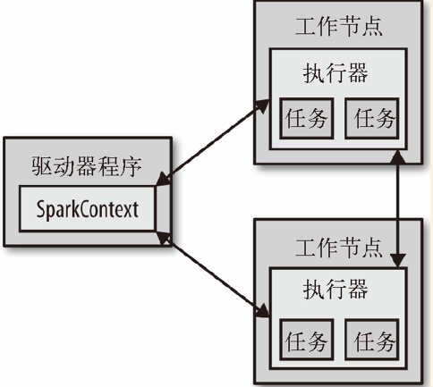

Spark使用Scala写的，运行在JVM上。

略过2.1节，下载Spark。

# 2.2 Spark中Scala的shell

Spark带有交互式的shell，可以作即时数据分析。Spark shell可以用来与分布式存储在多台机器上的的内存和硬盘上的数据进行交互，且处理过程的并发由Spark自动控制完成。

打开Scala版本的shell：

```shell
bin/spark-shell
```

控制日志的级别，要在`conf`目录下创建一个`log4j.properties`的文件：

```properties
log4j.rootCategory = WARN, console
```

在Spark中，我们通过对分布式数据集的操作来表达我们的计算意图。这些计算会自动在集群上进行。这样的数据集成为弹性分布式数据集（resilient distributed dataset，简称RDD）。RDD是Spark对分布式数据和计算的基本抽象

```
scala> val lines = sc.textFile("README.md") // 创建一个名为lines的RDD
lines: spark.RDD[String] = MappedRDD[...] 

scala> lines.count() // 统计RDD中的元素个数 
res0: Long = 127 

scala> lines.first() // 这个RDD中的第一个元素，也就是README.md的第一行
res1: String = # Apache Spark
```

# 2.3 Spark核心概念简介

从上层来看，每个Spark应用都有一个驱动程序（driver program）来发起集群上的各种并行操作。驱动器程序包含应用的`main`函数，并且定义了集群上的分布式数据集，还对这些数据集应用了相关操作。Spark shell本身就是动器程序，你只需要输入想要运行的操作就可以了。

驱动器程序通过一个`SparkContext`对象来访问Spark。这个对象代表了计算集群中的一个连接。shell启动时自动创建了一个`SparkContext`对象：`sc`。

一旦有了`SparkContext`，就可以用它来创建RDD。驱动程序一般要管理多个执行器（executor）节点来执行计算操作。



最后，很多用来传递函数的API，可以将对应操作运行在集群上。

```
scala> val lines = sc.textFile(" README.md") // 创 建 一 个 叫 lines 的 RDD 
lines: spark.RDD[ String] = MappedRDD[...] 

scala> val pythonLines = lines.filter( line = > line.contains(" Python")) 
pythonLines: spark.RDD[ String] = FilteredRDD[...] 

scala> pythonLines.first() 
res0: String = ## Interactive Python Shell
```

向Spark传递函数后，Spark会自动将函数发到各个执行器节点上。这样，你就可以在单一的驱动程序中编程，并且让代码自动运行在多个节点上。

# 2.4 独立应用

