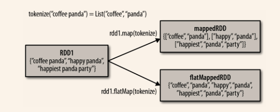
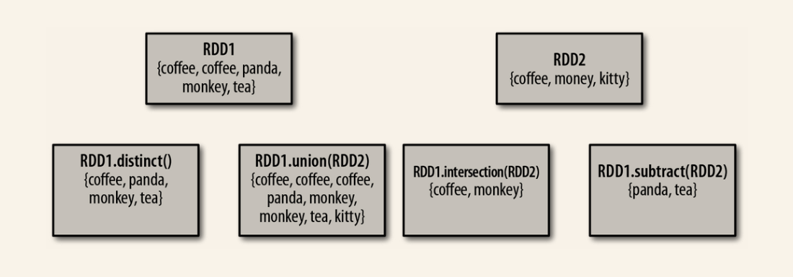
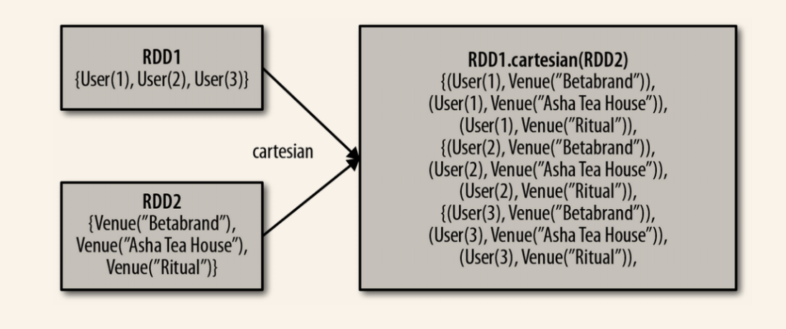

RDD是分布式的元素集合。在Spark中，对数据的所有操作无外乎是创建RDD、转换已有的RDD以及调用RDD操作进行求值。在这一切的背后，Spark会自动将RDD中的数据分发到集群上，并将操作并行化执行。

# 3.1 RDD基础

Spark中的RDD是一个不可变的分布式对象集合。每个RDD都被分为多个分区，这些分区运行在集群中的不同节点上。RDD可以包含Python、Java、Scala中的任意类型的对象，甚至可以包含用户自定义的对象。

用户有两种方法创建RDD：

- 读取一个外部数据集（如 `lines = sc.textFile("README.md"）`）
- 在驱动程序里分发驱动程序的对象集合（如`list`和`set`）

创建之后，RDD支持两种类型的操作：

- 转换操作。由一个 RDD 生成一个新的 RDD。例如：

  ```
  >>> pythonLines = lines.filter(lambda line: "Python" in line)
  ```

- 行动操作。对 RDD 计算出一个结果，并把结果返回到驱动器程序中，或把结果存储到外部存储系统（如 HDFS）中。

  ```
  >>> pythonLines.first()
  u'## Interactive Python Shell
  ```


虽然你可以在任何时候定义新的 RDD，但 Spark 只会惰性 计算这些 RDD。它们只有第一次在一个行动操作中用到时，才会真正计算**。

最后，默认情况下，Spark 的 RDD 会在你每次对它们进行行动操作时重新计算。如果想在多个行动操作中重用同一个 RDD，可以使用 `RDD.persist()` 让 Spark 把这个 RDD 缓存下来。

```
>>> pythonLines.persist

>>> pythonLines.count()
2

>>> pythonLines.first()
u'## Interactive Python Shell'
```

总的来说，每个 Spark 程序或 shell 会话都按如下方式工作：

1. 从外部数据创建出输入 RDD。
2. 使用诸如 filter() 这样的转化操作对 RDD 进行转化，以定义新的 RDD。
3. 告诉 Spark 对需要被重用的中间结果 RDD 执行 persist() 操作。
4. 使用行动操作（例如 count() 和 first() 等）来触发一次并行计算，Spark 会对计算进行优化后再执行。

# 3.2 创建RDD

创建 RDD 最简单的方式就是把程序中一个已有的集合传给 `SparkContext` 的` parallelize() `方法。

```scala
val lines = sc.parallelize(List("pandas", "i like pandas"))

```

更常用的方式是从外部存储中读取数据来创建 RDD。

```scala
val lines = sc.textFile("/path/to/README.md")
```

# 3.3 RDD操作

RDD 的转化操作是返回一个新的 RDD 的操作，比如 `map()` 和 `filter()` ，而行动操作则是向驱动器程序返回结果或把结果写入外部系统的操作，会触发实际的计算，比如 count() 和 first() 。

转化操作返回的是 RDD，而行动操作返回的是其他的数据类型。

## 3.3.1 转化操作

RDD 的转化操作是返回新 RDD 的操作。转化出来的 RDD 是惰性求值的，只有在行动操作中用到这些 RDD 时才会被计算。

```scala
val inputRDD = sc.textFile("log.txt")
val errorsRDD = inputRDD.filter(line => lins.contains("error"))
val warningsRDD = inputRDD.filter(line => line.contains("warning"))
val badLinesRDD = errorsRDD.union(warningsRDD)
```

`filter()` 操作不会改变已有的 inputRDD 中的数据。实际上，该操作会返回一个全新的 RDD。而`union()`可以操作两个RDD。

通过转化操作，你从已有的 RDD 中派生出新的 RDD，Spark 会使用谱系图 （lineage graph）来记录这些不同 RDD 之间的依赖关系。Spark 需要用这些信息来按需计算每个 RDD，也可以依靠谱系图在持久化的 RDD 丢失部分数据时恢复所丢失的数据。


## 3.3.2 行动操作

行动操作是第二种类型的 RDD 操作，它们会把最终求得的结果返回到驱动器程序，或者写入外部存储系统中。由于行动操作需要生成实际的输出，它们会强制执行那些求值必须用到的 RDD 的转化操作。

```scala
println("Input had " + badLinesRDD.count() + " concerning lines")
println("Here are 10 examples:")
badLinesRDD.take(10).foreach(println)
```

RDD 还有个`collect()`函数，可以获取整个RDD中的数据。但如果数据集很大，最好不要用`collect()`。

我们通常要把数据写到诸如 HDFS 或 Amazon S3 这样的分布式的存储系统中。你可以使用 `saveAsTextFile()` 、`saveAsSequenceFile()` ，或者任意的其他行动操作来把 RDD 的数据内容以各种自带的格式保存起来。”

## 3.3.3 惰性求值

惰性求值意味着当我们对 RDD 调用转化操作（例如调用 `map()` ）时，操作不会立即执行。相反，Spark 会在内部记录下所要求执行的操作的相关信息。我们不应该把 RDD 看作存放着特定数据的数据集，而最好把每个 RDD 当作我们通过转化操作构建出来的、记录如何计算数据的指令列表。把数据读取到 RDD 的操作也同样是惰性的。因此，当我们调用 `sc.textFile()` 时，数据并没有读取进来，而是在必要时才会读取。和转化操作一样的是，读取数据的操作也有可能会多次执行。

# 3.4 向Spark传递函数

Spark 的大部分转化操作和一部分行动操作，都需要依赖用户传递的函数来计算。

在 Scala 中，我们可以把定义的内联函数、方法的引用或静态方法传递给 Spark。传递的函数及其引用的数据需要是可序列化的（实现了 Java 的 Serializable 接口）。除此以外，传递一个对象的方法或者字段时，会包含对整个对象的引用。

```scala
class SearchFunctions(val query: String) {
  def isMatch(s: String): Boolean = {
    s.contains(query)
  }
  def getMatchesFunctionReference(rdd: RDD[String]): RDD[String] = {
    // 问题："isMatch"表示"this.isMatch"，因此我们要传递整个"this"
    rdd.map(isMatch)
  }
  def getMatchesFieldReference(rdd: RDD[String]): RDD[String] = {
    // 问题："query"表示"this.query"，因此我们要传递整个"this"
    rdd.map(x => x.split(query))
  }
  def getMatchesNoReference(rdd: RDD[String]): RDD[String] = {
    // 安全：只把我们需要的字段拿出来放入局部变量中
    val query_ = this.query
    rdd.map(x => x.split(query_))
  }
}
```

# 3.5 常见的转换操作和行动操作

## 3.5.1 基本RDD

### 1. 针对各个元素的转换操作

转化操作 `map()` 接收一个函数，把这个函数用于 RDD 中的每个元素，将函数的返回结果作为结果 RDD 中对应元素的值。

转化操作 `filter()` 则接收一个函数，并将 RDD 中满足该函数的元素放入新的 RDD 中返回。

![img/chap1/img2.png]

```scala
val input = sc.parallelize(List(1, 2, 3, 4))
val result = input.map(x => x * x)
println(result.collect().mkString(","))
```

`flatMap()`函数被分别应用到了输入 RDD 的每个元素上。不过返回的不是一个元素，而是一个返回值序列的迭代器。可以把 `flatMap()`看作将返回的迭代器“拍扁”，这样就得到了一个由各列表中的元素组成的 RDD，而不是一个由列表组成的 RDD。


```scala
val lines = sc.parallelize(List("hello world", "hi"))
val words = lines.flatMap(line => line.split(" "))
words.first() // 返回"hello
```



### 2. 伪集合操作



- `RDD.distinct()` 转化操作来生成一个只包含不同元素的新 RDD。不过需要注意，`distinct()` 操作的开销很大，因为它需要将所有数据通过网络进行混洗（shuffle），以确保每个元素都只有一份。
- `union(other)` ，它会返回一个包含两个 RDD 中所有元素的 RDD。如果输入的 RDD 中有重复数据，`union()`操作也会包含这些重复数据
- `intersection()`只返回两个 RDD 中都有的元素。`intersection()` 在运行时也会去掉所有重复的元素（单个 RDD 内的重复元素也会一起移除）。`intersection()`比`union()` 的性能却要差很多，因为它需要通过网络混洗数据来发现共有的元素。
- `subtract(other)` 函数接收另一个RDD作为参数，返回一个由只存在于第一个 RDD 中而不存在于第二个 RDD 中的所有元素组成的 RDD。和 `intersection()` 一样，它也需要数据混洗。
- `cartesian(other)` 转化操作会返回所有可能的 (a, b) 对，其中 a 是源 RDD 中的元素，而 b 则来自另一个 RDD。



### 3. 行动操作


