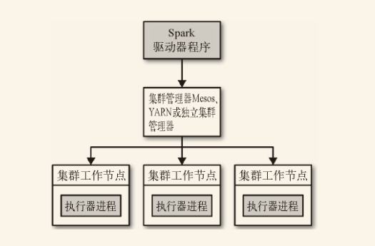

Spark 可以在各种各样的集群管理器（Hadoop YARN、Apache Mesos，还有 Spark 自带的独立集群管理器）上运行，所以 Spark 应用既能够适应专用集群，又能用于共享的云计算环境。

# 7.2 Spark 运行时架构

在分布式环境下，Spark 集群采用的是**主/从**结构。在一个 Spark 集群中，有一个节点负责中央协调，调度各个分布式工作节点。这个中央协调节点被称为驱动器 （Driver）节点，与之对应的工作节点被称为执行器 （executor）节点。驱动器节点可以和大量的执行器节点进行通信，它们也都作为独立的 Java 进程运行。驱动器节点和所有的执行器节点一起被称为一个 Spark 应用 （application）。

Spark 应用通过一个叫作集群管理器 （Cluster Manager）的外部服务在集群中的机器上启动。Spark 自带的集群管理器被称为独立集群管理器。Spark 也能运行在 Hadoop YARN 和 Apache Mesos 这两大开源集群管理器上。

