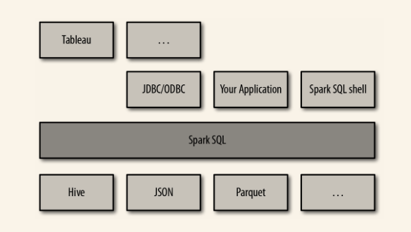

结构化数据是指任何有结构信息的数据。所谓结构信息，就是每条记录共用的已知的字段集合。当数据符合这样的条件时，Spark SQL 就会使得针对这些数据的读取和查询变得更加简单高效。具体来说，Spark SQL 提供了以下三大功能:

1. Spark SQL可以从各种结构化数据源（JSON、Hive、Parquet等）读取数据。
2. Spark SQL 不仅支持在 Spark 程序内使用 SQL 语句进行数据查询，也支持从类似商业智能软件 Tableau 这样的外部工具中通过标准数据库连接器（JDBC/ODBC）连接 Spark SQL 进行查询。
3. 当在 Spark 程序内使用 Spark SQL 时，Spark SQL 支持 SQL 与常规的 Python/Java/Scala 代码高度整合，包括连接 RDD 与 SQL 表、公开的自定义 SQL 函数接口等。

Spark SQL 提供了一种特殊的 RDD，叫作 SchemaRDD（新版本成为DataFrame）。SchemaRDD 是存放 Row 对象的 RDD，每个 Row 对象代表一行记录。SchemaRDD 还包含记录的结构信息（即数据字段）。SchemaRDD 可以利用结构信息更加高效地存储数据。此外，SchemaRDD 还支持 RDD 上所没有的一些新操作，比如运行 SQL 查询。SchemaRDD 可以从外部数据源创建，也可以从查询结果或普通 RDD 中创建。

# 9.1 连接Spark SQL