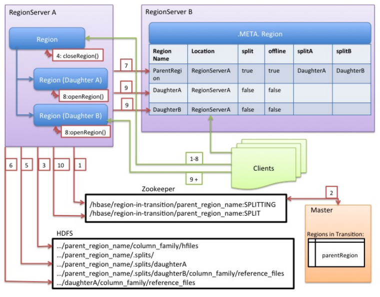

# 64. Overview

## 64.1 NoSQL?

HBase 是一个“NoSQL”数据库。NOSQL 不像传统的 RDBMS，不支持 SQL 语句。HBase 也缺少 RDBMS 的列类型、二级索引、触发器、高级查询语言。

HBase 支持线性化和模块化扩充，如果集群从10个扩充到20个RegionServer，存储空间和处理容量都同时翻倍。 RDBMS 也能很好扩充， 但仅对一个点 - 特别是对一个单独数据库服务器的大小 - 同时，为了更好的性能，需要特殊的硬件和存储设备。 HBase 特性：

- 强一致性读写: HBase 不是 "最终一致性(eventually consistent)" 数据存储. 这让它很适合高速计数聚合类任务。
- 自动分片(Automatic sharding): HBase 表通过region分布在集群中。数据增长时，region会自动分割并重新分布。
- RegionServer 自动故障转移
- Hadoop/HDFS 集成: HBase 支持本机外HDFS 作为它的分布式文件系统。
- MapReduce: HBase 通过MapReduce支持大并发处理， HBase 可以同时做源和目标.
- Java 客户端 API: HBase 支持易于使用的 Java API 进行编程访问.
- Thrift/REST API: HBase 也支持 Thrift 和 REST 作为非Java 前端.
- Block Cache 和 Bloom Filters: 对于大容量查询优化， HBase支持 Block Cache 和 Bloom Filters。
- 运维管理: HBase提供内置网页用于运维视角和JMX 度量.

## 64.2 什么时候需要 HBase？

- 足够多的数据。如果有上亿或上千亿行数据，HBase是很好的备选。 如果只有上千或上百万行，则用传统的RDBMS可能是更好的选择。因为所有数据可以在一两个节点保存，集群其他节点可能闲置。
- 确信可以不依赖所有RDBMS的额外特性 (e.g., 列数据类型, 第二索引, 事物,高级查询语言等.) 一个建立在RDBMS上应用，如不能仅通过改变一个JDBC驱动移植到HBase。相对于移植， 需考虑从RDBMS 到 HBase是一次完全的重新设计。
- 确信你有足够硬件。甚至 HDFS 在小于5个数据节点时，干不好什么事情 (根据如 HDFS 块复制具有缺省值 3), 还要加上一个 NameNode.

## 64.3 HBase 和 HDFS 的区别

HDFS 是分布式文件系统，适合保存大文件。官方宣称它并非普通用途文件系统，不提供文件的个别记录的快速查询。 另一方面，HBase基于HDFS且提供大表的记录快速查找(和更新)。

HBase 内部将数据放到索引好的 "存储文件(StoreFiles)" ，以便高速查询。存储文件位于 HDFS中。


# 65. 目录表（Catalog Tables）

目录表 `hbase:meta` 作为 HBase 表存在。他们被HBase shell的 list 命令过滤掉了， 但他们和其他表一样存在。

## 65.1 `-ROOT-`

`-ROOT-`表在 HBase 0.96.0 中被移除。

`-ROOT-`表保存了`.META`表（`hbase:meta`的曾用名）的位置信息，`-ROOT-` 表结构如下:

- Key:
    1. .META. region key (.META.,,1)
- Values:
1. info:regioninfo (序列化 .META.的 HRegionInfo 实例 )
2. info:server ( 保存 .META.的RegionServer的server:port)
3. info:serverstartcode ( 保存 .META.的RegionServer进程的启动时间)

## 65.2 `hbase:meta`

`hbase:meta` 表保存系统中所有region列表。现在保存在 ZooKeeper 中。`hbase:meta`表结构如下:

- Key:
    1. Region key 格式 ([table],[region start key],[region id])
- Values:
    1. info:regioninfo (序列化的 HRegionInfo 实例 )
    2. info:server ( 保存RegionServer的server:port)
    3. info:serverstartcode ( 保存RegionServer进程的启动时间)

表在拆分的过程中，会生成两列：`info:splitA`和`info:splitB`，代表拆分后的两个 region。两列的值也是序列化后的`HRegionInfo`实例。拆分完成后，这一行就被删除。

## 65.3 启动顺序

1. 在 ZooKeeper 中找到`hbase:meta`表的位置。
2. `hbase:meta`表会更新 server 和 startcode 的值.


# 66. Client

HBase客户端的负责寻找相应的 RegionServers 来处理行。他是先查询`hbase:meta`目录表。然后再确定region的位置。定位到所需要的区域后，客户端会直接 去访问相应的region(不经过master)，发起读写请求。这些信息会缓存在客户端，这样就不用每发起一个请求就去查一下。如果一个region已经废弃(原因可能是master load balance或者RegionServer死了)，客户端就会重新进行这个步骤，决定要去访问的新的地址。

## 66.1 集群连接

API 在 HBase 1.0 之后有所改变。

### HBase 1.0.0 API

HBase 1.0 的客户端返回的是`Interface`，而不是特定的数据类型。在 HBase 1.0中，

1. 使用`ConnectionFactory`获得`Connection`实例。
2. 根据需要，从`Connection`实例获得`Table`、`Admin`和`RegionLocator`。
3. 关闭 `Table`、`Admin`和`RegionLocator`。
4. 关闭`Connection`实例。

`Connection`是重量级的对象，但是线程安全的，建议在程序中共享一个`Connection`实例。`Table`等实例是轻量级的，可以人以创建、关闭。

### HBase 1.0.0之前的 API

HBase 1.0.0 之前使用`HTable`实例与 HBase 集群通信。

`HTable`不是线程安全的，任意时刻，一个`HTable`实例只能被只一个线程使用。建议使用同一个`HBaseConfiguration`实例来创建`HTable`实例。这样可以共享ZooKeeper和socket实例。例如，最好这样做：

```java
HBaseConfiguration conf = HBaseConfiguration.create();
HTable table1 = new HTable(conf, "myTable");
HTable table2 = new HTable(conf, "myTable");
```

#### 连接池

对需要高端多线程访问的应用，可以预先建立`Connection`，

```java
// Create a connection to the cluster.
Configuration conf = HBaseConfiguration.create();
try (Connection connection = ConnectionFactory.createConnection(conf);
     Table table = connection.getTable(TableName.valueOf(tablename))) {
  // use table as needed, the table returned is lightweight
}
```

> `HTablePool`已经在 0.94 和 0.95、0.96 废弃。0.98.1将之移除。`HConnection`从1.0后废弃。

## 66.2 WriterBuffer 和 批量方法

`Table`不会自动刷新。要想 Buffer 写，使用`BufferedMutator`类。

在`Table`实例销毁之前，调用`close`或`flushCommits()`，它携带的`Put`请求会被发送到服务器端。

要批量 Put 或 Delete，使用`Table`的批量方法。


## 66.3 外部客户端

非 Java 的客户端请看这里[Apache HBase External APIs](http://hbase.apache.org/book.html#external_apis)


# 67. 客户端请求过滤器

Get 和 Scan 实例可以用 filters 配置，以应用于 RegionServer.

## 67.1 结构过滤器

结构过滤器包含其他过滤器

### FilterList

FilterList 代表一个过滤器列表，过滤器间具有 `FilterList.Operator.MUST_PASS_ALL` 或 `FilterList.Operator.MUST_PASS_ONE` 关系。

```java
FilterList list = new FilterList(FilterList.Operator.MUST_PASS_ONE);
SingleColumnValueFilter filter1 = new SingleColumnValueFilter(
  cf,
  column,
  CompareOp.EQUAL,
  Bytes.toBytes("my value")
  );
list.add(filter1);
SingleColumnValueFilter filter2 = new SingleColumnValueFilter(
  cf,
  column,
  CompareOp.EQUAL,
  Bytes.toBytes("my other value")
  );
list.add(filter2);
scan.setFilter(list);
```

## 67.2 列值

### SingleColumnValueFilter
SingleColumnValueFilter 用于测试列值相等 (CompareOp.EQUAL ), 不等 (CompareOp.NOT_EQUAL),或范围 (e.g., CompareOp.GREATER). 下面示例检查列值和字符串'my value' 相等...

```java
SingleColumnValueFilter filter = new SingleColumnValueFilter(
	cf,
	column,
	CompareOp.EQUAL,
	Bytes.toBytes("my value")
	);
scan.setFilter(filter);
```

## 67.3 列值比较器

过滤器包内有好几种比较器类。这些比较器和其他过滤器一起使用, 如，

### RegexStringComparator
RegexStringComparator 支持值比较的正则表达式 。

```java
RegexStringComparator comp = new RegexStringComparator("my.");   // any value that starts with 'my'
SingleColumnValueFilter filter = new SingleColumnValueFilter(
	cf,
	column,
	CompareOp.EQUAL,
	comp
	);
scan.setFilter(filter);
```

### SubstringComparator
SubstringComparator 用于检测一个子串是否存在于值中。大小写不敏感。

```java
SubstringComparator comp = new SubstringComparator("y val");   // looking for 'my value'
SingleColumnValueFilter filter = new SingleColumnValueFilter(
	cf,
	column,
	CompareOp.EQUAL,
	comp
	);
scan.setFilter(filter);
```

其他过滤器注入`BinaryPrefixComparator`、`BinaryComparator`等。

## 67.4 KeyValue 元数据

由于HBase 采用键值对保存内部数据，键值元数据过滤器评估一行的键是否存在(如 ColumnFamily:Column qualifiers) 。

### FamilyFilter
FamilyFilter 用于过滤列族。 通常，在Scan中选择ColumnFamilie优于在过滤器中做。

### QualifierFilter
QualifierFilter 用于基于列名(即 Qualifier)过滤.

### ColumnPrefixFilter
ColumnPrefixFilter 可基于列名(即Qualifier)前缀过滤。

```java
Table t = ...;
byte[] row = ...;
byte[] family = ...;
byte[] prefix = Bytes.toBytes("abc");
Scan scan = new Scan(row, row); // (optional) limit to one row
scan.addFamily(family); // (optional) limit to one family
Filter f = new ColumnPrefixFilter(prefix);
scan.setFilter(f);
scan.setBatch(10); // set this if there could be many columns returned
ResultScanner rs = t.getScanner(scan);
for (Result r = rs.next(); r != null; r = rs.next()) {
  for (KeyValue kv : r.raw()) {
    // each kv represents a column
  }
}
rs.close();
```

### MultipleColumnPrefixFilter
MultipleColumnPrefixFilter 和 ColumnPrefixFilter 行为差不多，但可以指定多个前缀。

```java
Table t = ...;
byte[] row = ...;
byte[] family = ...;
byte[][] prefixes = new byte[][] {Bytes.toBytes("abc"), Bytes.toBytes("xyz")};
Scan scan = new Scan(row, row); // (optional) limit to one row
scan.addFamily(family); // (optional) limit to one family
Filter f = new MultipleColumnPrefixFilter(prefixes);
scan.setFilter(f);
scan.setBatch(10); // set this if there could be many columns returned
ResultScanner rs = t.getScanner(scan);
for (Result r = rs.next(); r != null; r = rs.next()) {
  for (KeyValue kv : r.raw()) {
    // each kv represents a column
  }
}
rs.close();
```

### ColumnRangeFilter
ColumnRangeFilter 可以进行高效内部扫描。

```java
HTableInterface t = ...;
byte[] row = ...;
byte[] family = ...;
byte[] startColumn = Bytes.toBytes("bbbb");
byte[] endColumn = Bytes.toBytes("bbdd");
Scan scan = new Scan(row, row); // (optional) limit to one row
scan.addFamily(family); // (optional) limit to one family
Filter f = new ColumnRangeFilter(startColumn, true, endColumn, true);
scan.setFilter(f);
scan.setBatch(10); // set this if there could be many columns returned
ResultScanner rs = t.getScanner(scan);
for (Result r = rs.next(); r != null; r = rs.next()) {
  for (KeyValue kv : r.raw()) {
    // each kv represents a column
  }
}
rs.close();
```

## 67.5 RowKey

### RowFilter

通常认为行选择时Scan采用 `startRow/stopRow` 方法比较好。然而 `RowFilter` 也可以用。

## 67.6 Utility

### FirstKeyOnlyFilter

This is primarily used for rowcount jobs. 参考 [FirstKeyOnlyFilter](http://hbase.apache.org/apidocs/org/apache/hadoop/hbase/filter/FirstKeyOnlyFilter.html).


# 68. Master

`HMaster`是 Master Server 的实现。Master 负责监控所有 RegionServer 实例，也是元数据改变的接口。在分布式集群中，Master 运行在 NameNode 上。详细阅读[HBase HMaster Architecture ](http://blog.zahoor.in/2012/08/hbase-hmaster-architecture/)

## 68.1 启动行为

如果一个集群中有多个 Master，它们会出现竞争集群的控制权。如果活跃的 Master 在 ZooKeeper 的租约到期或者宕机，剩下的 Master 会争相接管 Master 的角色。

## 68.2 运行时影响

Master 挂掉之后会发生什么呢？因为 HBase 的客户端直接与 RegionServer 通信，整个集群看上去运转良好。另外，`hbase:meta`表也不存在 Master。

但是，Master 负责维护 RegionServer 的灾难恢复、region 拆分，所以集群无 Master 状态下在运行一段时间后就会出错。

## 68.3 接口

`HMasterInterface`暴露的方法，都是面向元数据的：

- Table (`createTable`, `modifyTable`, `removeTable`, `enable`, `disable`)
- ColumnFamily (`addColumn`, `modifyColumn`, `removeColumn`)
- Region (`move`, `assign`, `unassign`)

## 68.4 进程

Master 运行着几个后台线程：

### LoadBalancer

没有 region 转换的时候，负载均衡器就会间歇性地运行、移动 region 来达到集群的均衡。

### CatalogJanitor

间歇性地，检查和清理`hbase:meta`表。


# 69. RegionServer

`HRegionServer`是 RegionServer 的实现，它负责服务和管理 region。在分布式集群中，RegionServer 运行在 DataNode 上。

## 69.1 接口

`HRegionRegionInterface`暴露的方法包括了面向数据和 region维护的方法：

- 数据（get/put/delete/next...)
- Region（splitRegion, compactRegion）
     例如当`Admin`执行在一个表上执行`majorCompact`，客户端实际上在迭代请求所有的 region 压缩。

## 69.2 进程

RegionServer 后台运行几种线程:

### CompactSplitThread
检查分割并处理最小紧缩。

### MajorCompactionChecker
检查主紧缩。

### MemStoreFlusher
周期将写到内存存储的内容刷到文件存储。

### LogRoller
周期检查RegionServer 的 HLog.


## 69.3 协处理器

协处理器在0.92版添加。 有一个详细帖子 [Blog Overview of CoProcessors](https://blogs.apache.org/hbase/entry/coprocessor_introduction) 供参考。

## 69.4 块缓存

HBase 提供了两种不同的块缓存实现：

- 堆上的`LruBlockCache`，默认
- `BucketCache`，通常在堆外

### 缓存选择

`LruBlockCache`是原始的实现，完全使用 Java 堆空间。`BucketCache`主要为堆外空间设计，尽管它也能将数据保存在堆上。

`BucketCache`从 0.98.6 后引入 HBase。

从`BucketCache`中取数据，比从`LruBlockCache`中慢得多，但要更稳定一些。因为`BucketCache`较少 GC。如果使用 off-heap 模式，`BucketCache`压根不用 GC。

当你打开`BucketCache`，你也就开启了双层缓存系统。L1缓存由`LruBlockCache`实例实现，off-heap 的 L2缓存由`BucketCache`实现。

双层缓存系统由`CombinedBlockCache`管理，它将数据块放在 L2 `BucketCache`，元数据块（INDEX 和 BLOOM）放在on-heap 的 L1 `LruBlockCache`。

### 通用缓存配置

[http://hbase.apache.org/devapidocs/org/apache/hadoop/hbase/io/hfile/CacheConfig.html](http://hbase.apache.org/devapidocs/org/apache/hadoop/hbase/io/hfile/CacheConfig.html)

设置这项选项后，需要重启集群才能生效。

### `LruBlockCache`设计

`LruBlockCache`缓存是一个 LRU 的缓存，它包括三种优先级块：

1. Single：如果一个Block第一次被访问，则放在这一优先级队列中；
2. Multi：如果一个Block被多次访问，则从Single队列移到Multi队列中；
3. In-memory：如果一个Block的 family 是inMemory的，则放到这个队列中

Block 换出的时候，会优先考虑 Single 队列，其次是 Multi，最后才是 In-memory。

将一个 Column Family 标记为 in-memory 的方法：

```java
HColumnDescriptor.setInMemory(true);
```

创建一个 in-memory 的表：

```
hbase> create 't', {Name => 'f', IN_MEMORY => 'true'}
```

### `LruBlockCache`使用

Block 缓存默认为所有用户表打开。

计算 HBase 所需缓存空间的公式：

```
number of region servers * heap size * hfile.block.cache.size * 0.99
```

block 缓存的默认值是0.25，意思是使用可用堆的25%空间。0.99 表示 LRU 缓存的负载因子。

其他需要考虑的因素：

- 目录表。`-ROOT-`和`hbase:meta`表默认缓存，且是 in-memory 级别。前者只占用几百字节，后者顶多及 MB。
- HFile 索引。HFile 有多层索引，索引的大小和块大小、key 的大小、存储数据的数量有关。单个 region server 的 HFile 索引有 GB 级也是正常的。
- Keys。The values that are stored are only half the picture, since each value is stored along with its keys.
- Bloom Filters。和 HFile 索引一样，也被存在 LRU 中。

HFile 索引和布隆过滤器的使用情况，可以在 RegionServer 的 Web UI 查看。

如果 WSS (working set size，计算需要使用的内存大小)没法放在内存里，那么使用块缓存也就没有意义。如：

1. 全量随机读取。缓存的命中率几乎为0，对这样的表设置块缓存就是浪费，也会产生更多的垃圾。
2. 映射一张表。每行数据只读一次的 Scan 操作，缓存也没啥意义。

#### 只缓存 META 块

只缓存 META 块，DATA 块不缓存。如果 `fscache` 能容下 DATA 块，那对随机读写超大数据集合来说非常有效。

为了让此设置生效，需要修改表和每个 Column Family 的属性：`BLOCKCACHE => 'false'`。这只是禁止了列族的 BlockCache，你永远无法禁止 META 块的缓存。

### Off-heap 块缓存

使用`BucketCache`的的常见姿势是双层缓存：

- L1 on-heap 的 `LruBlockCache`
- L2 的 `BucketCache`

双层缓存由 `CombinedBlockCache`管理。INDEX 和 BLOOM 放在 L1，DATA 块放置在 L2。HBase 1.0 之后可以改变这种配置，将 META 和 DATA 都放置在 L1：

```
hbase > create 't', {NAME => 't', CONFIGURATION => {CACHE_DATA_IN_L1 => 'true' }}
```

`BucketCache` 块缓存可以部署在 on-heap，off-heap，或者文件上，通过 `hbase.bucketcache.ioengine` 设置：

- `heap`
- `offheap`
- `file:PATH_TO_FILE`

如果想绕过`CombinedBlockCache`，设置`CacheConfig.BUCKET_CACHE_COMBINED_KEY`为`false`。这之后，从 L1中剔除的块会放在 L2。块缓存的时候，先放在 L1。查找块的时候，先找 L1, 然后在找 L2。这种模式称为 `Raw L1+L2`。

### 压缩 BlockCache

默认是关闭的，设置`hbase.block.data.cachecompressed`为`true`打开。它能够提升吞吐量、GC 性能。

打开之后，缓存中的 BlockCache 就是磁盘上的格式，它在缓存前不会解压、解密块。

## 69.5 RegionServer 拆分 

写请求由 RegionServer 处理，它们先被内存中，称之为`memstore`。一旦`memstore`满了，就会被刷写到磁盘中。存储文件聚集之后，RegionServer 会将它们合并成更少、更大的文件。 拆分策略决定了 region 是否需要拆分。

region 拆分的时候，数据不是立刻写到 `daughter regions`的文件中。它会创建很多类似软连接的小文件，称为`Reference files`，指向 parent 存储文件的顶部或底部（取决于拆分点）。`Reference file`向正常的数据文件一样使用，但只涉及所有记录的一般。当没有更多的引用指向不可变的数据文件时，region 就开始拆分。

RegionServer 需要在拆分前后通知 Master、更新`.META.`表、重新组织 HDFS 目录结构。为了错误回退，RegionServer在将操作日志保存在内存中。详细的拆分过程见[ RegionServer Split Process](http://hbase.apache.org/book.html#regionserver_split_process_image)。



1. RegionServer 在本地决定拆分 region，首先取得一个共享的读锁，防止 Schema 改变。然后在 ZooKeeper 中创建一个 znode，并将状态设置为`SPLITTING`。
2. Master 从 ZooKeeper 得知该 znode 的信息。
3. RegionServer 在 parent region 目录下创建一个名为`.splits`的子目录。
4. RegionServer 关闭 parent region，下线 parent region。这时，客户端关于该 region 请求会抛出`NotServingRegionException`。
5. RegionServer 在`.splits`目录下创建 daughter region A 和 B 的目录，添加必要的数据结构。然后拆分存储文件，这时有两个引用文件指向parentregion。
6. RegionServer 在 HDFS 上创建真正的 region 目录，移动引用文件的位置。
7. RegionServer 发送`Put`请求到`.META.`表，将 parent region 置为 offline，添加 daughter region的信息，但 daughter region 在表中没有单独的条目。这时 client 还是不能从`.META.`查到 daughter region 的信息。
8. RegionServer 并发打开 daughters A 和 B。
9. RegionServer 将 daughters A 和 B 的 host 信息加到`.META.`。这时两个 daughters 才上线。
10. RegionServer 更新 znode 状态为`SPLIT`，master 会得知该变化。这时拆分过程就算完成了。
11. 拆分后，引用文件仍然存在。daughter regions 在重写数据文件的时候删除它们。master 上的 GC 会定期检查 daughter region 是否有指向 parent region 的引用，如果没有，parent region 会被移除。

## 69.6 Write Ahead Log（WAL）

WAL 记录了 HBase 的所有改变记录，它保存在文件里。当 RegionServer 宕机而 MemStore 没有及时刷写的时候，WAL 就被用来回放数据的操作。如果写入 WAL 失败，则整个修改数据的操作就是失败。

每个 RegionServer 都有唯一的 WAL 实例。在记录到达 MemStore，需先写入 WAL 记录。

WAL 保存在 HDFS 的`/hbase/WALs`目录下。

### MultiWAL

一台 RegionServer 是串行写 WAL 的，这也是 WAL 的性能瓶颈。

HBase 1.0 引入了 MultiWAL，它允许 RegionServer 并发地写入多个 WAL 流。

要开启 MultiWAL，设置`hbase.wal.provider`为`multiwal`。

### WAL 刷写

TODO

### WAL 拆分

一台 RegionServer 有多个 region，这些 region 共享一个 WAL 文件。WAL 文件的修改必须按照 region 分组，方便以后重新生成 region 的数据。这个分组过程称之为 日志拆分。

日志拆分的时机：

1. 集群启动的时候，由`HMaster`完成。
2. RegionServer 宕机的时候，由`ServerShutdownHandler`完成。

日志拆分的过程：

1. `/hbase/WALs/<host>, <port>, <startcode>`目录重命名。确保已存在的、有效的 WAL 文件不会被仍活跃的 RegionServer 意外写入。
2. 一次拆分一个日志文件。
  一次读取一个修改条目并将其放入按 region 区分的 buffer。同时 RegionServer 启动多个写线程，负责将region 对应的修改条目放到临时的恢复文件中：
  ` /hbase/<table_name>/<region_id>/recovered.edits/.temp`。日志拆分完成后，`.temp`文件重命名为该文件第一条日志的序列 ID。这个序列 ID 就是用来确认是否所有的修改已经被写入 HFile。
3. 拆分完成后，每个受影响的 region 要指给 RegionServer。
  region 打开的时候，`recovered.edits`文件夹中的修改记录被写入 MemStore 。当所有的修改文件被重放后，MemStore 被写入 HFile，修改文件被删除。

#### 日志拆分的错误处理

`hbase.hlog.split.skip.errors`选项置为`true`，错误会被用如下方式处理：

1. 拆分中的所有错误会被记录。
2. 出错的 WAL 日志会被移到 HBase 根目录下的 `.corrupt`目录下。
3. 继续处理 WAL 。

如果置为`false`（默认情况下），异常会被抛出，拆分被记录为失败。

特殊地，即便`hbase.hlog.split.skip.errors`为`false`， `EOFException` 出现时，拆分仍然会继续。

#### 日志拆分的性能调优

分布式日志拆分对于性能的优化粒度极大，只需将`hbase.master.distributed.log.splitting`置为`true`。

分布式日志开启后，HMaster 就控制着拆分的过程，但实际的拆分工作还是 RegionServer 完成的：

1.  集群启动时，HMaster 会创建一个`split log manager`实例。

    manager 管理所有的日志文件，将所有的日志文件放到 ZooKeeper的日志拆分节点。

2. manager 监视日志拆分的 task 和 worker。

3. 每个 RegionServer 的拆分 worker 执行拆分 task。

4. manager 监视未完成的 task。

分布式日志回放，可以直接将 WAL 修改回放到另一台 RegionServer 上，而不用创建`recovered.edits`文件。它避免了创建和并行读取成千的`recovered.edits`文件，加快了 RegionServer 的恢复速度。


 # 70. Region

HBase 表的层次结构：

```
Table                    (HBase table)
    Region               (Regions for the table)
        Store            (Store per ColumnFamily for each Region for the table)
            MemStore     (MemStore for each Store for each Region for the table)
            StoreFile    (StoreFiles for each Store for each Region for the table)
                Block    (Blocks within a StoreFile within a Store for each Region for the table)
```

## 70.1 Region 个数的考量

HBase 被设计为在一台服务器上运行少量（20 ~ 200）的相对大（5 ~ 20G）的 region。

### 为什么要控制 Region 的个数？

通常情况下，一个 RegionServer 保持100个 region 是最优的。保持 region 个数较少的原因有：

- MemStore-local 为每个 MemStore分配的缓存是 2MB，这意味着每个 region 的每个 family 都是 2MB。其中 2MB 是可配置的。
- 过多的 region 会触发压缩。
- master 要承载更多的 region，指定、移动它们都是很大的复旦。
- HBase 的老版本，过多的 region 会触发 OOM。

## 70.2 Region -> RegionServer 的指派

### 启动

当HBase启动时，区域分配如下：

1. 启动时主服务器调用 `AssignmentManager`.
2. `AssignmentManager` 在 `hbase:meta` 中查找已经存在的区域分配。
3. 如果区域分配还有效（如 RegionServer 还在线） ，那么分配继续保持。
4. 如果区域分配失效，`LoadBalancerFactory` 被调用来分配区域。 `DefaultLoadBalancer` 将随机分配区域到RegionServer.
5. `hbase:meta` 随 RegionServer 分配更新（如果需要）， RegionServer 启动区域开启代码（RegionServer 启动时进程）。

### 故障转移

当区域服务器出故障退出时：

1. 区域立即不可获取，因为区域服务器退出。

2. 主服务器会检测到区域服务器退出。

3. 区域分配会失效并被重新分配，如同启动时序。

4. in-flight 查询重试

5. 所有的操作转向一台新的 RegionServer，延迟时间：

   `ZooKeeper session timeout + split time + assignment/replay time`。

### Region负载均衡

Region 之间的移动由 `LoadBalancer`控制。

### Region 状态转换


## 70.3 Region -> RegionServer 的本地化

Region 到 RegionServer 的本地化是由 HDFS 的 block 复制实现的。HDFS 客户端在选择读取replica 的位置时：

1. 第一个 replica 写入本地节点
2. 第二个 replica 写入另外一个机架的随机节点
3. 第三个 replica 写入同一个机架的另外一个随机节点
4. 余下的 replica 写入集群的随机节点


## 70.4 Region 拆分

RegionServer 分割操作是不可见的，因为 Master 不会参与其中。 RegionServer 切割region的步骤是，先将该region下线，然后切割，将其子region加入到`hbase:meta`元信息中，再将他们加入到原本的 RegionServer 中，最后汇报Master。

### 自定义分割策略

自定义的分割策略需要扩展 HBase 默认的`IncreasingToUpperBoundRegionSplitPolicy`。 可以从 HBase 的配置文件，或表的属性设置全局、局部的分割策略。

## 70.5 手动 Region 分割

Admin 可以手动拆分 region，但在此之前你要想好是否要拆分：

- 数据是按时间排序，这意味着读写压力都在最后一个 region 上。
- 某个 region 上存在热点。
- 集群中的 RegionServer 增加，要重写协调 region。
- Bulk-load 容易造成 region 的不平衡。

### 决定分割点

分割 reigon 的方式依赖于数据的特征，说白了就是 key 的设计。

- 字母数字的 Rowkey。使用字母或在数字边界来分割 region。
- 自定义的算法。HBase 提供了`RegionSplitter`工具，它采用`SplitAlgorithm`来决定分割点。它包括了两种分割算法：`HexStringSplit`将 Rowkey 看做是十六进制的字符串；`UniformSplit`将 Rowkey 看作是随机的字节数组。


## 70.6 在线的 region 合并

```
merge_region 'ENCODED_REGIONNAME', 'ENCODED_REGIONNAME', true
```

`merge_region` 请求是异步的，它不会等待合并完成而立刻返回。`true`表示强制 merge，默认情况下，只有相邻的 reigon 才能合并。

1. Client 发送合并的 RPC 请求到 Master
2. Master 将 region 移动到负载较重的 reigon 所在区域的 RegionServer。
3. Mater 发送合并请求给这台 RegionServer。

region 的合并在 RegionServer 看来就是一个本地事务。它

1. 下线 region，
2. 在文件系统上合并 region，
3. 更新 `hbase:meta`表中的 region 信息，
4. 打开合并后的 region，
5. 将合并汇报给 Master。


# 70.7 Store


