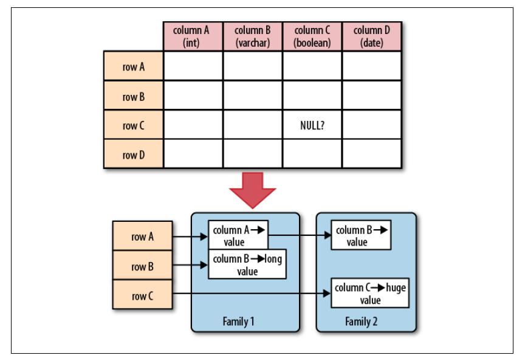
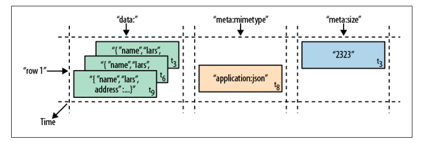

# 1.1 海量数据的黎明

数据的价值日益凸显。

Hadoop 擅长存储任意的、半结构化的数据，甚至是非结构化的数据。它几乎是现有数据库系统的一种补充，给用户提供了数据存储的无限空间。

大多数的RDBMS都遵守Codd's 12 rules。列式存储数据库以列为单位聚合数据，然后将列值顺序地存入磁盘，而行式数据库则是连续地存储整行。列式存储的出现是基于这一假设：对于特定的查询，不是所有的值都是必须的。另外，列式存储对压缩更友好。

HBase 以列式存储的格式在磁盘上存储数据。传统的列式数据库适合实时存储数据的场景，而HBase适合键值对的数据存取，或者有序的数据存取。

# 1.2 关系数据库系统的问题

RDBMS 适合有限的数据量，但对于数据急剧增长的情况就力不从心了。减少压力的常见做法有：

1. 读写分离，即保留一个master只服务写请求。但写请求的压力无法缓解。

2. 增加缓存，如Memcached。这种方案无法保证数据一致性。

   ​

# 1.3 NoSQL

在NoSQL范畴内，有很多维度可以区分系统的特定优势。

## 1.3.1 维度

- **数据模型**。键值对、半结构化的列式存储和文档结构存储？
- **存储模型**。内存还是持久化？
- **一致性模型**。严格一致性还是最终一致性？
- **物理模型**。分布式还是单机？
- **读写性能**。读多写少还是写多读少？
- **辅助索引**。支持用户按不同的字段和排序方式来访问表。
- **故障处理**。故障处理之后能否正常共工作？
- **压缩**。有可选择的压缩组件吗？
- **负载均衡**。能否随着负载自动均衡处理？
- **原子操作的读写**。RDBMS提供了这类操作，但在分布式系统中较难实现。
- **加锁、等待、死锁**。支持哪种锁模型，能否避免等待和死锁？

## 1.3.2 可扩展性

RDBMS 适合事务性操作，但不擅长超大规模的数据分析处理，因为查询需要大范围的扫描。更糟的是，RDBMS 出现死锁和等待的频率，会随着事务和并发而剧增。

## 1.3.3 数据库的范式化和反范式化

|        | 优点                                       | 缺点                           |
| ------ | ---------------------------------------- | ---------------------------- |
| 范式化模型  | 因为数据没有冗余，更新容易                            | 当查询设计很多关联模型（join）时，会导致查询性能低下 |
| 反范式化模型 | 数据冗余将带来很好的读取性能（因为不需要join很多表，而且通常反范式模型很少做更新操作） | 需要维护冗余数据（但磁盘并不贵，对吗？）         |

# 1.4 结构

## 1.4.2 表

最基本的单位是列。一列或多列形成一行，并由唯一的行键来确定存储。反过来，一个表有若干行，其中每列有多个版本，在每个单元格中存储了不同的值。

若干个列组成一个列族（family）。一个列族的所有列存储在同一个底层的存储文件中，即HFile。列族需要在表创建时就定义好，且不能修改地太频繁，数量也不能太多，只限于几十个，列族名必须由可打印字符组成。

列（qualifier）数量没有限制，可以有几百万个，列值也没有类型和长度的限制。

每一列的值或单元格的值都有时间戳，由系统默认指定，也可由用户显示设置。根据不同的时间戳可以获得不同版本的值。用户可以指定每个值保存的最大版本数。

基于时间的行的组成部分：

行数据的存取操作是原子的，可以读写任意数目的列。HBase是有强一致性的。

## 1.4.3 自动分区

HBase中扩展和负载均衡的基本单位是region，region是以行键排序的连续存储的区间。如果region太大，系统会将其动态拆分，相反的话就合并。

每个region只能由一台region server加载，一个server可以加载多个region。

当一个服务器出现故障后，该服务器上的region可以快速恢复。如果某个region server不可用时，系统会转移该region。

## 1.4.4 存储API

与RDBMS不同，HBase 没有特定领域语言，如SQL。数据存取不以声明的方式完成，而是通过客户端API的命令完成的。

API 提供了建表、删表、增加列族、删除列族等操作，还可以修改表和列族元数据的功能。此外，它还提供了对给定的行键值进行增加、删除和查找的操作。

协处理器（coprocessor）支持服务器执行来自客户端的代码。

## 1.4.5 实现

# 导航

[目录](README.md)

下一章：

