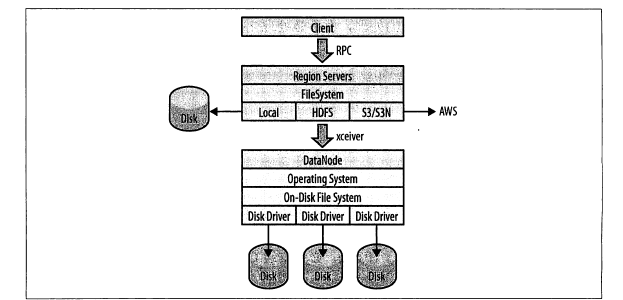

# 2.1 快速启动指南

`conf/hbase-site.xml` 配置文件中的 `base.root.dir`设置了数据路径。

```shell
bin/start-hbase.sh
bin/hbase shell
```

常用的 shell 命令：`create`、`list`、`put`、`get`、`scan`、`delete`、`drop`。

PS. 删除表之前，必须禁用它。


# 2.2 必备条件

HBase大多是和Hadoop安装自爱一起的，这样可以减少网络I/O，同时加快处理速度。在同一台服务器上运行Hadoop和HBase时，至少会有3个Java进程：DataNode、TaskTracker、RegionServer。

## 硬件

- CPU

  采用多核处理器，四核以上。最好每个基本的Java进程都可以独立占有一个核。


- 内存

  使用Java时，不该为一个进程设置过多内存。内存在Java中成为堆。堆的碎片整理会stop-the-world。为region server设置超过16GB的堆是很危险的，一旦发生Full GC会造成很长时间的重写内存操作，master会判定进程已经死掉并将其移除。

- 磁盘

  用户应该保证每个磁盘上至少一个核。8核服务器增加6块磁盘是较优的。


 ## 软件

- 操作系统

  任何一个支持Java的OS上。

- 文件系统。

  比较常见的有ext3、ext4和XFS。

- Java

  1.6 以上才能很好地支持HBase。

- Hadoop

  HBase 只能依赖特定版本的 Hadoop，原因是两者之间的RPC协议是版本化的。

- SSH

  用户管理HBase进程需要安装ssh并运行sshd。HBase提供的shell脚本需要通过SSH将命令发送到集群中的每个服务器上执行。

- 域名服务

  HBase 使用本地域名汇报IP地址。正向与反向DNS局可以工作。

- 同步时间

  节点的时间必须是一致的，可以稍有偏差。

- 文件句柄和进程限制

  修改`ulimit -n` ，针在HBase用户下。

- DataNode处理线程数

  修改`conf/hdfs-site.xml`中的`dfs.datanode.max.xceivers`。

- 交换区

  给操作系统进程预留足够的内存，且JVM堆大小设置不要太大。一旦内存接近可用物理内存，操作系统就会使用交换区。

  修改`/etc/sysctl.conf`的`vm.swappiness=5`来减少交换空间的概率。

  ​


# 2.3 HBase使用的文件系统

HBase 使用的文件系统是一个可插拔的架构。其中HDFS是最受欢迎的，因为它包含了冗余、容错、可扩展性。

通过设置URI模式，就可以选择不同的文件系统。



## 本地模式

本地文件系统完全绕过了Hadoop，不使用HDFS或其他任何集群。用户设置以下参数就可以直接访问本地文件系统了：

```
file://<path>
```

## HDFS

HDFS 是默认的文件系统，HBase增加了随机存取层，是HDFS缺失的部分。

```
hdfs://<namenode>:<port>/<path>
```

## S3

S3 文件系统实现了Hadoop支持的两种不同模式：

1. 原生模式。

   ```
   s3n://<bucket-name>
   ```

   直接将数据写入S3，与本地文件系统类似。

2. 块模式

   ```
   S3://<bucket-name>
   ```

   克服了S3最大文件为5GB的限制。

## 其他文件系统

KFS（Kosmos filesystem），是一个用C++编写的、开源的、分布式的、高性能的文件系统，功能上与HDFS类似。

```
kfs:///<path>
```


# 2.4 安装选项

