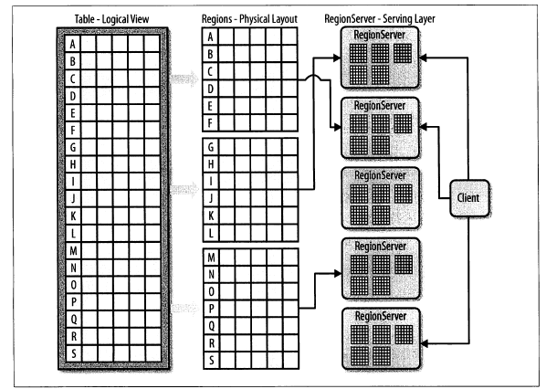
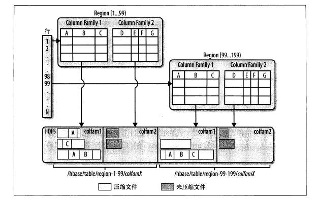

# 5.1 模式定义

## 5.1.1 表

表描述符的构造函数：

```java
HTableDescriptor(String name)
```

region 中行的逻辑与物理视图：



## 5.1.2 表属性

- 名

  ```java
  byte[] getName();
  void setName(byte[] name);
  ```

- 列族

  ```java
  void addFamily(HColumnDescriptor family);
  boolean hasFamily(byte[] c);
  HColumnDescriptor getColumnFamilies();
  HColumnDescriptor removeFamily(byte[] column)
  ```

- 文件大小限制。限制表中 region 的大小，达到限制使会拆分region。

  ```java
  long getMaxFileSize();
  void setMaxFileSize(long maxFileSize);
  ```

- 只读。默认所有的表都可写。

  ```java
  void setReadOnly(boolean readOnly);
  ```

- memstore 刷写大小

  ```java
  long getMemStoreFlushSize();
  ```

- 延时日志刷写

  ```java
  synchronized boolean isDeferredLogFlush();
  ```

- 其它选项

  ```java
  byte[] getValue(byte[] key);
  void remove(byte[] key);
  ```

## 5.1.3 列族

列族的名字必须是可见字符，由任意二进制字符组成。



`HColumnDescriptor`实例支持以下方法：

```java
byte[] getName(); // 除了调用构造函数，没有其他重命名列族的途径
int getMaxVersions();
Compression.Algorithm getCompression(); // 一般压缩
Compression.Algorithm getCompactionCompression(); // 合并压缩
synchronized int getBlocksize;
boolean isBlockCacheEnabled();
int getTimeToLive(); // 版本数据的保存时间
boolean isInMemory();
StoreFile.BloomType getBloomFilterType(); // 行或列是否使用过滤器
int geScope(); // 复制范围，提供了跨集群同步的功能。
```


# 5.2 `HBaseAdmin`

