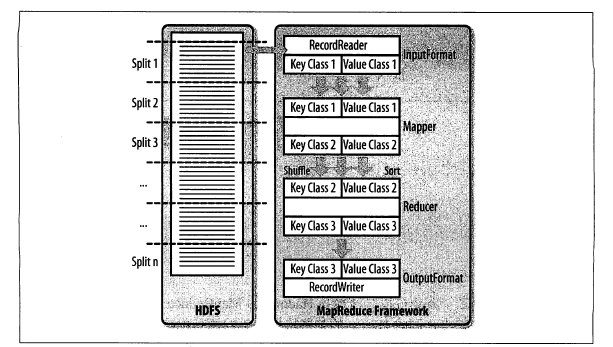

# 7.1 框架

下图简明地展示了 MapReduce 处理数据的过程。首先它会可靠地将输入的数据拆分成大小合理的块，然后服务器每次处理一个块。

## 7.1.2 类

### `InputFormat`

`InputFormat`负责两件事：

1. 拆分输入数据；
2. 返回一个`RecordReader`实例，这个实例定义了键值对象的类，提供了`next()`方法遍历。

就 HBase 而言，她提供了一个`TableInputFromatBase`，可以扫描全表。

### `Mapper`

从`RecordReader`读到的每一个数据都由一个`map()`方法来处理。

HBase 提供了一个`TableMapper`类，将键的类型转换为`ImmutableBytesWritable`，同时将值的类型强制转换为`Result`类型，这构成了`TableRecordReader`类返回的结果。

### `Reducer`

在 Mapper 和 Reducer 阶段间的内部 shuffle 阶段，每个不同的 Map 输出的中间结果都会被复制到 Reduce 服务器，同时 sort 阶段会将所有经过 shuffled 阶段处理的数据进行联合排序。这样Reducer得到的中间结果就是一个已排序的数据集，这个数据集中，每一个特定的键与它所有可能的值都关联在一起。

### `OutputFormat`

最后阶段由`OutputFormat`处理，它将数据持久化到不同的位置：HBase 或文件。如输出值HBase，使用`TableOutputFormat`类。

## 7.1.3 支撑类

MapReduce 的支撑类与 `TableMapReduceUtil`类一同协作在HBase上执行 MapReduce 作业。它有一个静态方法能配置作业，并使作业可以以 HBase 做数据源和目标。

## 7.1.4 MapReduce 的执行地点

HBase 利用 HDFS的块备份策略来为上层提供持久化存储。每块的数据都被指定到一个 map 任务处理。

HBase 的存储过程通过HFile和日志文件（WAL）实现。

HDFS 上的文件写入之后是不可修改的，HBase会将多个文件合并为一个新的文件。

## 7.1.5 表拆分

MapReduce 使用`TableInputFormat`去的数据时，使用`getSplit()`来确定如何划分块，从而由块数决定映射任务的数量。

作业启动时，框架会按拆分的数目调用`createRecordReader`，并返回与当前块对应的`TableRecordReader`实例。换句话说，每个`TableRecordReader`实例处理一个对应的region，读取并遍历region的所有行。

# 7.2 在 HBase 之上的 MapReduce

当运行 MapReduce 作业所需库的类不是绑定在 Hadoop 或 MapReduce 框架时，用户一般有两个选择：

1. 在所有的任务节点上准备静态的库，

2. 直接提供作业所需的所有库。

> 鉴于 Spark 风头正劲，MapReduce 这篇先行掠过。

# 导航

[目录](README.md)

上一章：[6. 可用客户端](6. 可用客户端.md)

下一章：[8. 架构](8. 架构.md)