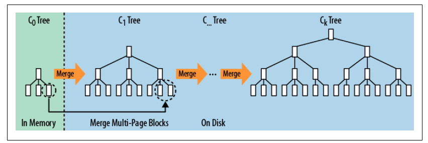
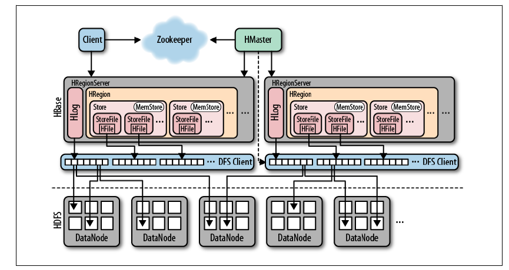
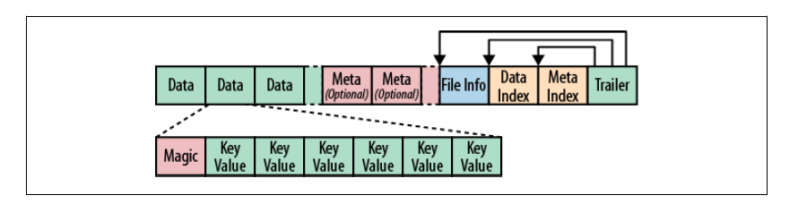
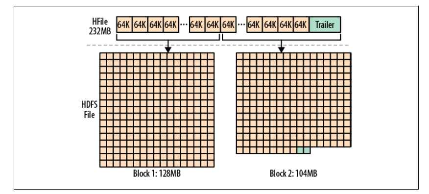
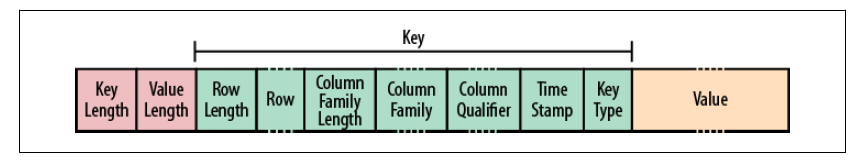
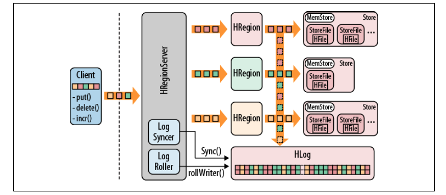

# 8.1 数据查找和传输

B 树和 B+ 树，被广泛用于关系型存储引擎，同时还有 LSM 树（Log-Structured Merged Tree)，它在某种程度上构成了 BigTable 的底层存储架构。

# 8.1.1 B+树

B+ 树能够通过主键对记录进行高效插入、查找和删除。它表示一个动态、多层、有上下界的索引。

B+ 树能够提供高效的范围扫描功能，这得益于它的叶节点相互连接且按主键有序，避免了耗时的遍历树操作。

## 8.1.2 LSM树

LSM 树，输入数据首先被存储在日志文件，这些文件内的数据完全有序。当有日志文件被修改时，对应的更新会被先保存在内存来加速查询。

当系统经历过很多次数据修改，且内存空间被逐渐占满，LSM 树会把有序的键值对写到磁盘中，同时创建一个新的数据存储文件。此时，内存中保存的最近更新就可以丢弃了。

存储文件的组织与 B+ 树类似，不过其为磁盘顺序读取做了优化，所有节点都是满的并按页存储。修改数据文件的操作，通过滚动合并完成。也就是说，系统将现有的页与内存刷写数据混合在一起进行管理，直到数据块达到它的容量。

下图展示了多个块存储归并到磁盘的过程，这是后台线程自动完成的：



查询时，先查找内存中的存储，然后再查找磁盘上的文件。

删除是一种特殊的更改，当删除标记被存储后，查找会跳过这些键。当页眉重写时，有删除标记的键会被丢弃。

B 树和 LSM 树的最主要区别在于如何利用硬件，特别是磁盘。

# 8.2 存储

## 8.2.1 概览



从上图中可以看出，HBase 主要处理两种文件：

- 预写日志（Write-Ahead Log，WAL）
- 数据文件

两种文件主要由 HRegionServer 管理。

一个基本的流程是：

1. 客户端首先联系 ZooKeeper 子集群（quorum，一个由 ZooKeeper 节点组成的单独集群）查找行键。ZooKeeper 通过`.META`表来获取含有`-ROOT-`的 region server。
2. HBase 缓存此次查询的信息，同时直接联系实际管理数据的 `HRegionServer`。
3. `HRegionServer` 负责打开 region，并创建对应的 `HRegion` 实例。HRegion 打开后，`HRegionServer` 会为每个表的 `HColumnFamily` 创建一个 `Store` 实例。每个 `Store` 实例包含了一个或多个 `StoreFile`，它们是实际数据存储文件 `HFile` 的轻量级封装。每个 `Store` 还有个与之对应的 `MemStore`。

## 8.2.2 写路径

当用户向`HRegionServer`发起`HTable.put(Put)`请求时，会被交给对应的 `HRegion`实例处理：

1. 决定数据是否需要写到由 `HLog`类实现的 WAL 中。WAL 时标准的 Hadoop SequenceFile，并存储了`HLogKey`实例。
2. 数据被写入到 WAL 后，再被写入`MemStore`中。同时检查`MemStore`是否已满，满了就写到磁盘。刷写请求时由另外一个`HRegionServer`线程处理，它会把数据写成`HFile`。同时也会保存最后写入的序号，系统就知道哪些数据被持久化了。

## 8.2.3 文件

HBase 在 HDFS 中的目录默认为"/hbase"。`hdfs dfs -lsr /hbase`可以查看目录结构。


- WAL 文件。每个`HRegionServer`，都有一个对应的子目录，该子目录下有多个`HLog`文件。一个 region server的所有 region 共享同一组`HLog`文件。当日志文件包含的修改被持久化到存储文件后，他们会被移到`oldWALS`文件夹。
- `hbase.id`和`hbase.versoin`包含了集群的唯一 ID 和文件格式版本信息。
- `corrupt`文件夹把偶存了损坏的日志。
- 表级的数据都在`data`目录下。每张表目录都包括一个`.tableinfo`的顶层文件，该文件存储了对应序列化后的`HTableDescriptor`。`.tmp`包括了一些临时数据。
- region 级文件。每张表的目录里，每个列族都有一个单独的目录，目录的名字是 region 名字的 MD5。region 目录也有一个`.regioninfo`文件，这个文件包含了 region 的`HRegionInfo`实例序列化后的信息。

在 WAL 回放时，任何未提交的修改都会被写入每个 region 的一个单独目录中。如果日志拆分过程已经完成，这些文件被自动移动到临时的`recovered.edits`目录中。当 region 被打开时，region server会看到需要恢复的文件，并回放其中相应的条目。

一旦region 超过了配置的阈值，region 就会被拆分。其间会创建一个对应的`splits`目录。拆分成功后，它们会移动到表目录中，并形成了两个新的 region。

### 合并

合并（compaction）过程将它们合并成数量更少、体积更大的文件。这个过程持续到这些文件中最大的文件超过配置的最大存储文件大小，此时会触发一个 region 拆分。

压缩有两种：

- minor。负责重写最后生成的几个文件到一个更大的文件。文件数量受`hbase.hstore.compaction.min`控制。
- major。负责将所有文件压缩成一个单独的文件。

在执行压缩检查时，系统自动决定运行哪种合并。在`memstore`被刷写到磁盘后触发检查，或在 Shell 命令`compact`、`major_compact`之后触发，或者是调用相应 API 之后触发。

除非用户使用`major_compact`将强制运行 major 合并，否则服务器会首先检查上次运行到现在是否达到`hbase.hregion.majorcompaction`设置的时限。如果还没有达到 major 合并的执行周期，系统会选择 minor 合并执行。

当 minor 合并包括所有的存储文件，且所有文件均未达到设置的每次压缩的最大文件数时，minor 合并可能被提升为 major 合并。

## 8.2.4 HFile 格式

HFile 基于 Hadoop 的`TFile`类。



文件长度是可变的，唯一固定的块是`File Info`和`Trailer`块。

- `Trailer`块有指向其他块的指针，它是持久化数据到文件结束时写入的，写入后确定其为不可比那的数据存储文件。
- `Data`和`Meta`块都是可选的。
- `Index`记录了`Data`和`Meta`的偏移量。

块大小由`HColumnDescriptor`配置的，默认是 64KB。建议将块的带澳设置为8KB ~ 1MB。如果主要涉及顺序访问，较大的块更合适，这会降低随机读写性能。较小的块更有利于随机访问，不过同时需要更多的内存来存储块索引，且可能创建过程也会变慢。

HDFS 中，文件的默认快大小是 64MB，是 HFile 默认块大小的1024倍。这两者没有相关性。HBase 并不知道 HBase 存储的是什么，只能看到二进制文件。



绕过 HBase 直接访问一个 HFile 的方法：

```shell
bin/hbase org.apache.hadoop.hbase.io.hfile.HFile
```

## 8.2.5 KeyValue 格式

HFile 中的每个 KeyValue 都是一个低级的字节数组。

 

开头的两个定长数字分别表示键长度、值长度。有了这个信息，用户可以在数据上跳跃。

键包含了行键、列族、列限定符。

# 8.3 WAL

WAL 存了对数据的所有更改，如果服务器崩溃，它可以有效地回放日志，恢复数据。

所有的修改先保存到 WAL，再传递给 memstore：



1. 客户端启动一个操作来修改数据，每个修改都被封装到一个 KeyValue 对象中，并通过 RPC 发送出去。
2. KeyValue 会被送到管理相应行的`HRegion`实例，数据被写入到 WAL，然后被放入实际拥有记录的存储文件的 memstore。
3. 当 memstore 达到一定大小或经历特定时间，数据就会异步地连续写入到文件系统中。

## 8.3.2 `HLog` 类

实现了 WAL 的类叫做`HLog`。当`HRegion`被实例化时，`HLog`实例会被当做一个参数传递到`HRegion`构造函数中。当 region 接收到一个更新操作时，它可以直接将数据保存到一个共享的 WAL 实例中。

`HLog`的核心功能是`append`方法。

`HLog`的另一个特性是追踪修改，这个特性使用序列号来实现。


## 8.3.3 `HLogKey`类

WAL 使用的是 Hadoop SequenceFile。这种文件按照键/值集合的方式存储记录。对于 WAL 来说，Key 是`HLogKey`实例，值是客户端发送的修改请求。

`HLogKey`存储了 region 、表名、序列号、表的写入时间，KeyValue 仅仅代表行键、列族、列限定符、时间戳、类型以及值。

## 8.3.4 `WALEdit`类

客户端发送的每一个修改被封装到`WALEdit`实例。它通过日志级别来管理原子性。

## 8.3.5 `LogSyncer`类

表的描述符允许用户设置一个`延迟日志刷写`标识。它意味着每一次编辑被发送到服务器时，服务器都会调用写日志的`sync()`方法，这个强迫写入日志的更新都会被文件系统确认。

用户将该标识设置为`true`会导致修改被魂村在 region serverongoing，然后在服务器上`LogSyncer`类会作为一个线程运行，负责在非常短的间隔内`sync()`。


