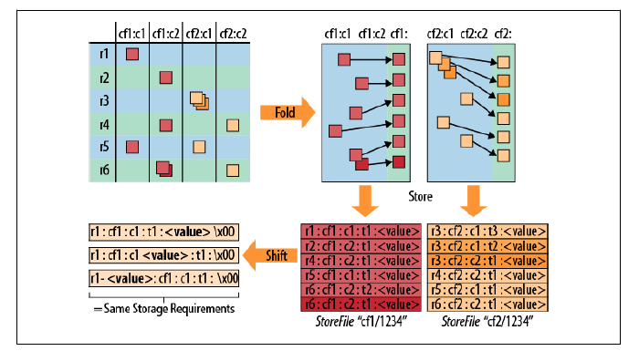
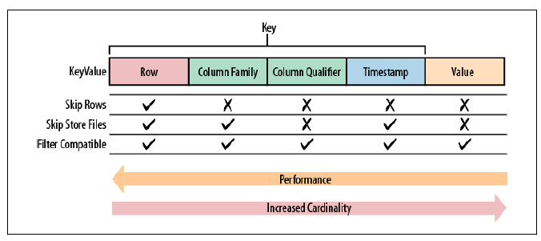
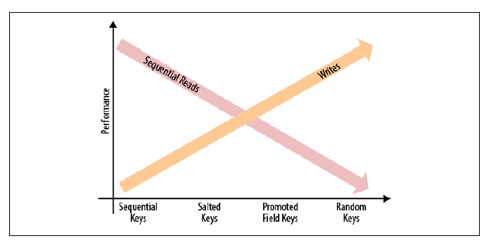

# 9.1 行键设计

HBase 有两种基本的键结构：行键（row key）和列键（column key），两者都可以存储有意义的信息。这些信息有两类：

- 键本身存储的内容。
- 键的排列顺序。

## 9.1.1 概念

HBase 表中的数据分隔主要是用列族而不是列。图片的左上角展示了数据的逻辑布局，右上角展现了数据从逻辑布局到物理布局的转换。每一行的单元格有序存储，不同列族的数据存储在不同的文件中。换句话说，磁盘上一个列族下的所有单元格都存储在一个文件（store file）中，不同列族的单元格不会出现在同一个存储文件中。

HBase 不存储没有值的单元格，同一个单元格的多个版本被单独存储为连续的单元格，并添加必要的时间戳。单元格按照时间戳将序排列，保证 HFile 的 Reader 先读到的是最新的值。

含有结构信息的整个单元格在 HBase 中叫做 KeyValue，其中不仅包含用户生成时设定的列和值，还包括行键和时间戳。KeyValue 存储时先按行键排序，再按列键排序。

图片的右下角展示一个一张逻辑表在物理存储文件中的数据布局。

从左到右查询数据的性能变差：

## 9.1.2 高表与宽表

高表列少行多，而宽表则正好相反。根据前一段的介绍，用户应该尽量将需要查询的维度或信息存储在**行键**中，因为用它筛选的效率最高。

此外，HBase 只能按行分片，因此高表更有优势。

## 9.1.3 部分键扫描

HBase 的扫描功能和基于`HTable`的 API 更适合在高表上筛选数据。

用户可以根据查询精度的要求，构造特定的起始键和终止键来查询所需的数据。

## 9.1.4 分页

使用起始键和终止键的同时，也可以添加`offset`和`limit`参数来筛选数据。

## 9.1.5 时间序列

处理流式信息时，常见的是按时间序列组织的数据。这样有可能会引发*热点问题*，所有的更新都集中于一个 region server。

想要将数据分散到所有的 region 服务器上，可以：

- 加盐。使用 salt 前缀，这样做的缺点是用户要扫描一个连续的范围时，需要对每个 region server 都发起请求。这样也会带来并发量的好处。
- 字段交换/提升权重。如果用户设计的行键已经包含多个字段了，可以调整它们的位置。
- 随机化。使用 MD5 之类的散列函数将行键分散到所有 region server 上。随机化的方式适合每次只读取一行数据的应用。

总结一下，找到读写性能的平衡点不是一件简单的事儿，用户的数据访问模式决定了最终的行键结构。

## 9.1.6 时间顺序关系

每个列族下的列可以作为一个辅助索引单独进行排序，所有按照时间产生的数据，可以以独立行插入 HBase，也可以以列插入。后者对于少量的索引时适用的。

# 9.2 高级模式

每列的值都可以存储为任意字节数组的数据，借助 Avro 和 Protocol Buffer可以表示更复杂的、嵌套的结构：

- Avro

  HAvroBase 是一个使用 Avro 在每列中存储复杂记录的项目。它使用 Avro 的接口定义语言（IDL）来定义实际的模式。

- Protocol Buffer

  用 Protocol Buffer 的IDL 来定义一个外部模式，这个模式被用来序列化复杂的数据结构到 HBase 的列中。

# 9.3 辅助索引

HBase 没有为辅助索引提供原生的支持。通常的需求是用户能够通过主坐标（行键、列族、列限定符）来查找一个单元格。辅助索引存储了一个新坐标与现有坐标之间的映射关系。

## 由客户端管理索引

把责任完全转移到应用层的典型做法是把一个数据表和一个（或多个）查找/映射表结合起来。每当程序写数据表时，它也同时更新映射表（辅助索引表）。

读数据时可以直接在主表中查询，先从辅助索引表中查找原表行键，再再原表中读取实际数据。

HBase 不能保证跨行操作的原子性。从事务的角度来看，用户不能保证主表和依赖表的一致性。

## 带索引的事务型 HBase

开源的 ITHBase 提供了一个带索引的事务型 HBase 的解决方案，并增加了特殊的客户端和服务端类的实现。

最核心的扩展是增加了用来保证所有的辅助索引更新操作一致性的事务功能。在此基础上，提供了一个客户端类 `IndexedTableDescriptor`，这个类定义了一个数据表的辅助索引支持。

## 带索引的  HBase

另一种方案 IHBase 放弃了为每个索引使用单独的表，而是完全再内存中维护索引。当一个 region 第一次被打开，或者一个 memstore 被刷写到磁盘时，用户可以通过扫描整个 region 来建立索引。

当磁盘上的数据有索引时，内存中数据搜索的方式如下：它直接使用内存中的数据来搜索索引相关的详细数据。这个方案的优点时索引永远是同步的，且不需要额外的事务控制。

与基于表的索引相比，IHBase 有两方面不同：

1. 它很快，索引数据都在内存中，可以二分查找。
2. 需要大量额外的堆空间来维护索引。

缺点也很明显：

1. 入侵型很强，需要额外的 JAR 文件和配置来替换重要的客户端类和服务端类。
2. 需要额外的资源，尽管它使用内存交换了额外的 I/O 需求。
3. 它再按照基于辅助索引定义的排列顺序查询数据时，需要在数据表傻姑娘做随机查找。

## 协处理器

使用协处理器框架提供的服务端的钩子，且不用替换任何客户端类和服务端类。协处理器将为每一个 region 载入索引层，并维护索引。

# 9.4 搜索集成

