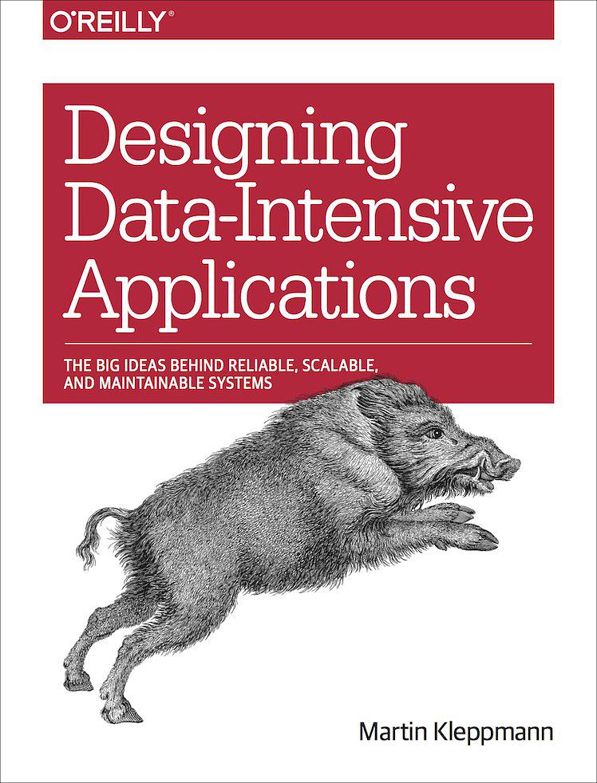

<!-- START doctoc generated TOC please keep comment here to allow auto update -->
<!-- DON'T EDIT THIS SECTION, INSTEAD RE-RUN doctoc TO UPDATE -->
**Table of Contents**  *generated with [DocToc](https://github.com/thlorenz/doctoc)*

- [Part I: Foundations of Data Systems](#part-i-foundations-of-data-systems)

<!-- END doctoc generated TOC please keep comment here to allow auto update -->

Reading notes for [Designing Data Intensive Applications](https://book.douban.com/subject/26197294/).

# Part I: Foundations of Data Systems

[1. Reliable, Scalable, and Maintainable Applications](ch1.md)

[2. Data Models and Query Languages](ch2.md)

[3. Storage and Retrieval](ch3.md)

[4. Encoding and Evolution](ch4.md)
