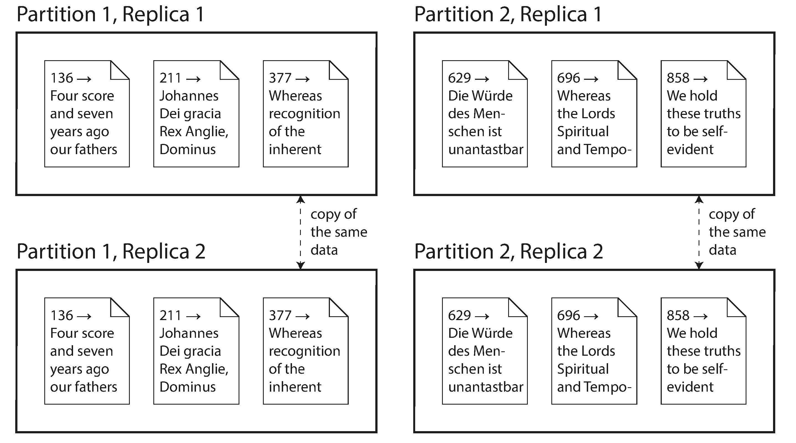

<!-- START doctoc generated TOC please keep comment here to allow auto update -->
<!-- DON'T EDIT THIS SECTION, INSTEAD RE-RUN doctoc TO UPDATE -->
**Table of Contents**  *generated with [DocToc](https://github.com/thlorenz/doctoc)*

- [Part I: Foundations of Data Systems](#part-i-foundations-of-data-systems)
- [Part II. Distributed Data](#part-ii-distributed-data)
  - [Scaling to Higher Load](#scaling-to-higher-load)
  - [Shared-Nothing Architectures](#shared-nothing-architectures)
  - [Replication Versus Partitioning](#replication-versus-partitioning)

<!-- END doctoc generated TOC please keep comment here to allow auto update -->

Reading notes for [Designing Data Intensive Applications](https://book.douban.com/subject/26197294/).

# Part I: Foundations of Data Systems

[1. Reliable, Scalable, and Maintainable Applications](ch1.md)

[2. Data Models and Query Languages](ch2.md)

[3. Storage and Retrieval](ch3.md)

[4. Encoding and Evolution](ch4.md)

# Part II. Distributed Data

There are various reasons why you might want to distribute a database across multiple machines:
- Scalability
- Fault tolerance/high availability
- Latency

## Scaling to Higher Load

If all you need is to scale to higher load, the simplest approach is to buy a more powerful machine (sometimes called *vertical scaling* or *scaling up*). Many CPUs, many RAM chips, and many disks can be joined together under one operating system, and a fast interconnect allows any CPU to access any part of the memory or disk. In this kind of **shared-memory architecture**, all the components can be treated as a single machine.

The problem with a shared-memory approach is that the cost grows faster than linearly: a machine with twice as many CPUs, twice as much RAM, and twice as much disk capacity as another typically costs significantly more than twice as much. 

A shared-memory architecture may offer limited fault tolerance—high-end machines have hot-swappable components (you can replace disks, memory modules, and even CPUs without shutting down the machines)—but it is definitely limited to a single geographic location.

Another approach is the **shared-disk architecture**, which uses several machines with independent CPUs and RAM, but *stores data on an array of disks that is shared between the machines*, which are connected via a fast network. This architecture is used for some data warehousing workloads, but contention and the overhead of locking limit the scalability of the shared-disk approach.

## Shared-Nothing Architectures

**Shared-nothing architectures** (sometimes called *horizontal scaling* or
*scaling out*) have gained a lot of popularity. In this approach, each machine or virtual machine running the database software is called a node. Each node uses its CPUs, RAM, and disks independently. Any coordination between nodes is done at the software level, using a conventional network.

## Replication Versus Partitioning

There are two common ways data is distributed across multiple nodes:

- Replication
    Keeping a copy of the same data on several different nodes, potentially in different locations. Replication provides redundancy.
- Partitioning
    Splitting a big database into smaller subsets called partitions so that different partitions can be assigned to different nodes (also known as *sharding*).

[5. Replication](ch5.md)

[6. Partitioning](ch6.md)

[7. Transactions](ch7.md)

[8. The Trouble with Distributed Systems](ch8.md)

