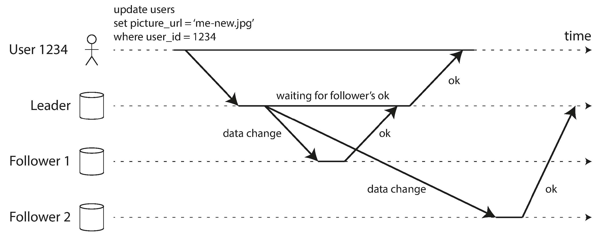

Replication means keeping a copy of the same data on multiple machines that are
connected via a network. There are several reasons why you might want to replicate data:

- To keep data *geographically close* to your users (and thus reduce *latency*)
- To allow the system to continue working even if some of its parts have failed
(and thus increase *availability*)
- To scale out the number of machines that can serve read queries (and thus increase *read throughput*)

All of the difficulty in replication lies in handling changes to replicated data. We will discuss three popular algorithms for replicating changes
between nodes: 

- single-leader, 
- multi-leader, 
- and leaderless replication. 

There are many trade-offs to consider with replication: for example, whether to use synchronous or asynchronous replication, and how to handle failed replicas.

# Leaders and Followers

Each node that stores a copy of the database is called a *replica*. With multiple replicas, a question inevitably arises: how do we ensure that all the data ends up on all the replicas?

Every write to the database needs to be processed by every replica; otherwise, the replicas would no longer contain the same data. The most common solution for this is called leader-based replication (also known as *active/passive* or *master–slave* replication):

1. One of the replicas is designated the leader (also known as master or primary). When clients want to write to the database, they must send their requests to the leader.
2. The other replicas are known as followers (read replicas, slaves, secondaries, or hot standbys). Whenever the leader writes new data to its local storage, it also sends the data change to all of its followers as part of a replication log or change stream. Each follower takes the log from the leader and updates its local copy of the database accordingly, by applying all writes in the same order as they were processed on the leader.
3. When a client wants to read from the database, it can query either the leader or any of the followers. However, writes are only accepted on the leader.

This mode of replication is a build-in feature of

- MySQL, PostgresSQL
- MongoDB, Espresso
- Kafka, RabbitMQ

## Synchronous Versus Asynchronous Replication

The advantage of synchronous replication is that the follower is guaranteed to have an up-to-date copy of the data that is consistent with the leader. If the leader suddenly fails, we can be sure that the data is still available on the follower. The disadvantage is that if the synchronous follower doesn’t respond,  The leader must block all writes and wait until the synchronous replica is available again.

In practice, if you enable synchronous replication on a database, it usually means that one of the followers is synchronous, and the others are asynchronous. If the synchronous follower becomes unavailable or slow, one of the asynchronous followers is made synchronous. This guarantees that you have an up-to-date copy of the data on at least two nodes. This configuration is sometimes also called *semi-synchronous*.

Often, leader-based replication is configured to be completely asynchronous. In this case, if the leader fails and is not recoverable, any writes that have not yet been replicated to followers are lost.

## Setting Up New Followers

How do you ensure that the new follower has an accurate copy of the leader’s data? Simply copying data files from one node to another is typically not sufficient: clients are constantly writing to the database, and the data is always in flux, so a standard file copy would see different parts of the database at different points in time.

Fortunately, setting up a follower can usually be done without downtime. 

1. Take a consistent *snapshot* of the leader’s database at some point in time—if possible, without taking a lock on the entire database. 
2. Copy the snapshot to the new follower node.
3. The follower connects to the leader and requests all the data changes that have happened since the snapshot was taken. This requires that the snapshot is associated with an exact position in the leader’s replication log.
4. When the follower has processed the backlog of data changes since the snapshot, we say it has caught up. 

## Handling Node Outages

### Follower failure: Catch-up recovery

On its local disk, each follower keeps a log of the data changes it has received from the leader. If a follower crashes and is restarted, or if the network between the leader and the follower is temporarily interrupted, the follower can recover quite easily: from its log, it knows the last transaction that was processed before the fault occurred.

Thus, the follower can connect to the leader and request all the data changes that occurred during the time when the follower was disconnected.

### Leader failure: Failover

Handling a failure of the leader is trickier: one of the followers needs to be promoted to be the new leader, clients need to be reconfigured to send their writes to the new leader, and the other followers need to start consuming data changes from the new leader. This process is called *failover*.

An automatic failover process usually consists of the following steps:

1. Determining that the leader has failed. There is no
foolproof way of detecting what has gone wrong, so most systems simply use a
timeout: nodes frequently bounce messages back and forth between each other,
and if a node doesn’t respond for some period of time—say, 30 seconds—it is
assumed to be dead. 
2. Choosing a new leader. This could be done through an election process (where
the leader is chosen by a majority of the remaining replicas), or a new leader
could be appointed by a previously elected controller node. 
3. Reconfiguring the system to use the new leader. Clients now need to send
their write requests to the new leader. 

If the old leader comes back, it might still believe that it is the leader,
not realizing that the other replicas have forced it to step down. The system
needs to ensure that the old leader becomes a follower and recognizes the new
leader.

Failover is fraught with things that can go wrong:

- If asynchronous replication is used, the new leader may not have received all the writes from the old leader before it failed. If the former leader rejoins the cluster after a new leader has been chosen, what should happen to those writes? 
- Discarding writes is especially dangerous if other storage systems outside of the database need to be coordinated with the database contents. 
- In certain fault scenarios, it could happen that two nodes both believe that they are the leader. This situation is called split brain, and it is dangerous:
if both leaders accept writes, and there is no process for resolving conflicts.
- What is the right timeout before the leader is declared dead?

## Implementation of Replication Logs

### Statement-based replication

The leader logs every write request (statement) that it executes and sends that statement log to its followers. For a relational database, this means `INSERT`, `UPDATE`, or `DELETE` statement.

There are various ways in which this approach to replication can break down:

- Any statement that calls a nondeterministic function, such as *NOW()*.
- If statements use an auto-incrementing column, or if they depend on the existing data in the database (e.g., `UPDATE` … `WHERE` <some condition>), they must be executed in exactly the same order on each replica. This can be limiting when there are multiple concurrently executing transactions.
- Statements that have side effects (e.g., triggers, stored procedures, user-defined functions) may result in different side effects occurring on each replica.

By default MySQL now switches to row-based replication (discussed shortly) if there is any nondeterminism in a statement.

### Write-ahead log (WAL) shipping

The log is an *append-only sequence of bytes* containing all writes to the database. We can use the exact same log to build a replica on another node.

This method of replication is used in PostgreSQL and Oracle, among others. The main disadvantage is that the log describes the data on a very low level: this makes replication closely coupled to the storage engine.

### Logical (row-based) log replication

A logical log for a relational database is usually a sequence of records describing writes to database tables at the granularity of a row:

- For an inserted row, the log contains the new values of all columns.
- For a deleted row, the log contains enough information to uniquely identify the row that was deleted. Typically this would be the primary key.
- For an updated row, the log contains enough information to uniquely identify the updated row, and the new values of all columns (or at least the new values of all columns that changed).

A transaction that modifies several rows generates several such log records, followed by a record indicating that the transaction was committed. MySQL’s binlog (when configured to use row-based replication) uses this approach.

### Trigger-based replication

Some tools, such as Oracle GoldenGate, can make data changes available to an application by reading the database log. An alternative is to use features that are available in many relational databases: *triggers* and *stored procedures*.

A trigger lets you register custom application code that is automatically executed when a data change (write transaction) occurs in a database system. The trigger has the opportunity to log this change into a separate table, from which it can be read by an external process.

# Problems with Replication Lag

# Navigation

[Table of Contents](README.md)

Prev: [4. Encoding and Evolution](ch4.md)

Next: [6. Partitioning](ch6.md)
