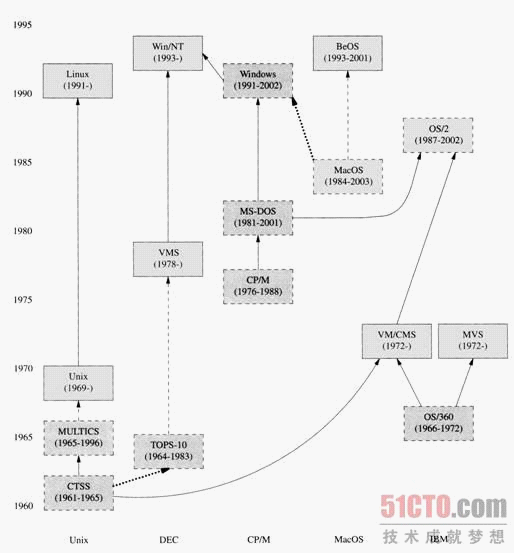

# 3.1 操作系统的风格元素

与不同操作系统相关的设计和编程风格可以追溯出三个源头：

（a）操作系统设计者的意图；
（b）成本和编程环境的限制对设计的均衡影响；
（c）文化随机漂移，传统无非就是先入为主。

## 操作系统的统一性理念
Unix有几个统一性的理念或象征，并塑造了它的API及由此形成的开发风格。其中最重要的一点应当是“一切皆文件”模型及在此基础上建立的管道概念。彻头彻尾的反Unix系统，就是没有任何统一性理念，胡乱堆砌起的一些唬人特性而已。

**多任务能力** Unix系统拥有抢先式多任务（preemptive multitasking）能力。在Unix中，时间片由调度程序来分配，这个调度程序定期中断或抢断正在运行的进程而把控制权交给下一个进程。

**协作进程** 在Unix中，低价的进程生成和简便的进程间通讯（IPC Inter-Process Communication）使众多小工具、管道和过滤器组成一个均衡系统成为可能。管道和所有其他经典Unix IPC方法有一个精微的性质，就是要求把程序间的通讯简化到某一程度而促使功能分离。相反地，如果没有与管道等效的机制，则程序必须在完全相互了解对方内部细节的基础上设计程序，才能实现彼此间的合作。

**内部边界** Unix提倡设立多个帐户，每一个帐户具有专属、可能不同的权限，以保护用户不受行为不端程序的侵害。系统程序通常都有自己的“伪用户(pseudo-user)帐号”，以访问专门的系统文件，而不需要无限制的（或者说超级用户的）访问权限。

Unix至少设立了三层内部边界来防范恶意用户或有缺陷的程序。一层是内存管理：Unix用硬件自身的内存管理单元（MMU）来保证各自的进程不会侵入到其它进程的内存地址空间。第二层是为多用户设置的真正权限组——普通用户（非root用户）的进程未经允许，就不能更改或者读取其他用户的文件。第三层是把涉及关键安全性的功能限制在尽可能小的可信代码块上。在Unix中，即使是shell（系统命令解释器）也不是什么特权程序。

**文件属性和记录结构** Unix文件既没有记录结构(record structure)也没有文件属性。

**二进制文件格式** Unix采用透明的二进制格式，采用简单工具就可以读写

**首选用户风格界面**
**目标受众** Unix是程序员写给程序员的，这个目标用户群在界面复杂度的承受力是出了名的。
**开发的门槛** Unix开创了轻松编程的先河。廉价工具和简单接口支持。

# 3.2 操作系统的比较

分时操作系统历史示意图

## VMS
VMS具有完全抢占式多任务处理能力，但是进程生成的开销极为昂贵。VMS文件系统有复杂的记录类型（但还不是记录属性）概念。这些特性程序庞大、个体臃肿的倾向。

VMS的特点是具有长长的、可读的、类COBOL的系统命令和命令选项。它具有非常全面的在线帮助（针对的不是API，而是可执行程序和命令行语法）。

VMS的内部边界系统有口皆碑。它为真正的多用户操作而设计，完全利用硬件MMU来保护进程互不干扰。系统命令解释器具有优先权，但在另一方面，关键功能封装则做得相当不错。VMS的安全漏洞一直都很罕见。

VMS工具最初很贵，界面也很复杂。

和Unix一样，VMS早就有了客户端/服务器的划分。作为一个通用分时系统，VMS在它的时代是成功的。

## MacOS
MacOS有一个不同于Unix的坚定统一性理念：Mac界面方针。这些方针的主旨是：东西永远呆在你摆的地方。文档、目录和其它东西在桌面上都有固定的、系统不会弄乱的位置，重启后桌面依然保持原样。所有的程序都得有GUI，根本没有CLI。脚本的功能有倒是有，但绝对不像Unix中那样常用

MacOS也强烈支持把应用程序的元数据(如菜单结构)从引擎中隔离。

MacOS系统的内部边界系统很弱。因为基于只有单个用户这样的固定设想，所以没有用户权限组。多任务处理是协作式的，不是抢占式的。所有的 MultiFinder应用都在同一个地址空间运行，所以任何应用程序的不良代码都能破坏操作系统低层内核以外的任何部分。

## OS/2
OS/2使用抢先式多任务处理，从来都不是一个多用户系统。虽然它的进程生成开销相对较低，但是IPC困难而脆弱。网络能力最初仅限于LAN协议，但后续版本也增加了 TCP/IP协议栈。因为没有类似于Unix的服务守护程序，所以，OS/2处理多功能网络的能力一直欠佳。

OS/2既有CLI又有GUI。OS/2流传下来的亮点大多围绕它的桌面Workplace Shell(WPS)。几年后，OS/2成为Linux GNOME工程的模型。

WPS的类层次设计是OS/2的统一性理念之一。另一个统一性理念是多线程处理。OS/2程序员大量使用线程，部分代替了对等进程间的IPC，协作程序工具包传统也因此没能形成。

OS/2的内部边界达到了单用户操作系统的预期。运行的进程互不干扰，内核空间也和用户空间互不干扰，但是没有了基于每用户的特权组。这意味着文件系统无法防范恶意代码。另一个结果是没有类似于起始目录的东西，应用程序的数据往往散布在整个系统中。

## Windows NT
NT是逐步堆积而成的，缺乏对应于Unix“一切皆文件”或MacOS桌面的统一性理念。由于它的核心技术没有扎根于一小群稳固的中枢观念中，因此每过几年就会过时。

套接字编程没有类似Unix那种“一切皆是文件句柄”的统一数据对象，因此在Unix中很简单的多道程序设计和网络应用到NT下则要牵涉更多基础性概念。

NT的一些文件系统类型也有文件属性，但仅限用于为实现某些文件系统的访问控制列表，因此对开发风格不会产生太大影响。NT也有文本和二进制这两种记录类型区别，时不时地讨人嫌（NT和OS/2都从DOS那里继承了这个不良特性）。

尽管支持抢先式多任务处理，但进程生成却很昂贵。脚本功能薄弱，操作系统广泛使用二进制文件格式。

大多数程序都不能用脚本调用。程序间依赖复杂脆弱的远程过程调用（RPC）来通信，这是滋生bug的温床。

根本就不存在通用工具。

Unix的系统配置和用户配置数据分散存放在众多的dotfiles(名字以“.”开头的文件)和系统数据文件中，而NT则集中存放在注册表中。

NT的内部边界漏洞太多。NT有访问控制列表，可用于实现用户权限组管理，但许多遗留代码对此视而不见.

## BeOS
BeOS的统一性理念是“深入地线程化”、多媒体流和数据库形式的文件系统。BeOS的设计目标是尽可能减少内核延迟，从而能非常适合实时处理大量数据。
    
BeOS采用的是Unix模型，在字节级以上没有文件结构。BeOS和MacOS一样支持和使用文件属性。事实上，BeOS文件系统就是一个数据库，可以按任意属性索引。

Unix的这些竞争对手最明显的通病是*不可移植性，不具备良好的网络支持能力*。

除了拥有与生俱来的服务器操作系统体系优势外，Unix一直不明确界定自己的目标受众。Unix的设计者和实现者从不自认为已经完全清楚Unix的所有潜在用途。

# 导航

[目录](README.md)

上一章：[2. 历史-双流记](2. 历史-双流记.md)

下一章：
