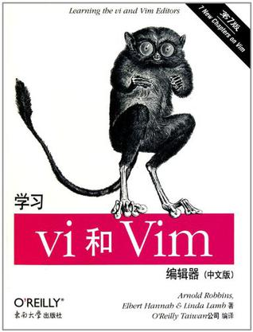

<!-- START doctoc generated TOC please keep comment here to allow auto update -->
<!-- DON'T EDIT THIS SECTION, INSTEAD RE-RUN doctoc TO UPDATE -->
**Table of Contents**  *generated with [DocToc](https://github.com/thlorenz/doctoc)*

- [目录](#%E7%9B%AE%E5%BD%95)

<!-- END doctoc generated TOC please keep comment here to allow auto update -->

[《学习vi和Vim编辑器》](https://book.douban.com/subject/6126937/)读书笔记。

# 目录

[1. vi文本编辑器](1. vi文本编辑器.md)

[2. 简单的文本编辑器](2. 简单的文本编辑器.md)

[3. 快速移动位置](3. 快速移动位置.md)

[4. 越过基础的藩篱](4. 越过基础的藩篱.md)

[5. ex编辑器概述](5. ex编辑器概述.md)
